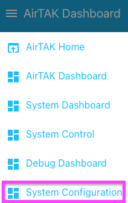

# AryaOS Site page

The **AryaOS Site** page is the single most important admin surface on the device. It edits the site-wide settings in `/etc/aryaos/aryaos-config.txt` — the file inherited by every PyTAK sensor gateway — plus onboarding, radios, updates, VPN, and support tooling. Open it from Cockpit's menu, or directly at `https://aryaos-xxxx.local/admin/` → **AryaOS Site**.



!!! info "How saving works"
    The page edits known keys **in place** and preserves everything else in the file, including comments. Most cards apply immediately, but the **TAK destination** and TLS fields at the top only take effect when you press **Save & restart sensors** (or **Save only**) at the bottom of the page — see [Save & restart](#save-restart). Cards with their own buttons (role, hotspot, radios, updates, VPN, support, Node-RED) act on their own.

The cards appear in the order below.

---

## TAK destination

**What it does.** Sets where local CoT feeders send their [Cursor on Target (CoT)](../reference/glossary.md) events, chooses the ADS-B decoder, and names the UAT dongle.

| Field | Config key | Default | Meaning |
|-------|-----------|---------|---------|
| Site COT_URL | `COT_URL` | `udp+wo://127.0.0.1:28087` | Where every local feeder sends CoT |
| ADS-B decoder | `ARYAOS_ADSB_DECODER` | `readsb` | `readsb` or `dump1090_fa` |
| UAT (978 MHz) RTL-SDR serial | `ARYAOS_UAT_RTL_SERIAL` | `stx:978:0` | EEPROM serial dump978-fa binds to |

The default **Site COT_URL** feeds the local **Charontak hub** on `udp+wo://127.0.0.1:28087`. Charontak then forwards that stream to Mesh SA and/or a TAK Server through its own lanes.

!!! tip "Keep the default unless you know why"
    For almost every deployment you should leave `COT_URL` pointed at the Charontak hub and configure your actual upstream (Mesh SA, TAK Server) in the [Charontak lane editor](./charontak-lanes.md). Only change `COT_URL` when you are deliberately bypassing Charontak — for example, to send every feeder directly to `tls://takserver.example.com:8089` or `udp+wo://239.2.3.1:6969`. This is the CoT routing invariant: **feeders → charontak → Mesh SA / TAK Server**.

The **ADS-B decoder** drop-down offers `readsb` (RTL-SDR / SoapySDR / HackRF) and `dump1090-fa` (FlightAware). Only one 1090 MHz decoder runs at a time.

!!! warning "Changing the decoder needs a service switch too"
    Setting `ARYAOS_ADSB_DECODER` records *which* decoder should be enabled, but it does not by itself start or stop systemd units. Re-apply the [device role](./aryaos-site.md#device-role) after changing the decoder — the role logic enables the selected decoder and disables the other. See [Radios & SDRs](../config/radios-sdr.md) for the full switch procedure.

The **UAT serial** must differ from the 1090 MHz serial. See [Radios (RTL-SDR)](#radios-rtl-sdr) below and [Radios & SDRs](../config/radios-sdr.md).

---

## Device role

**What it does.** Chooses which sensor pipelines run on this unit. The **CoT core** — Charontak, LINCOT, GPSTAK, and gpsd — always runs; the role enables its sensor services at boot and stops the rest.

| Role | Pipelines |
|------|-----------|
| Multi-sensor | All pipelines (ADS-B, AIS, drones) |
| Air | ADS-B 1090/978 aircraft |
| Maritime | AIS vessels |
| C-UAS | Drone detection |
| Relay | CoT routing only (no sensors) |

The card lists the exact sensor services the selected role will enable ("Sensor services for this role: …"). Press **Apply role**; you will be asked to confirm, because services outside the chosen role are **stopped and disabled at boot**.

**Config key:** the choice is persisted as `ARYAOS_ROLE` in the site config and applied by the `aryaos-role set` helper. Full unit-by-unit detail is in [Device roles](../config/device-roles.md).

!!! note "Applies immediately"
    Unlike the TAK destination fields, applying a role runs right away and does not wait for **Save & restart sensors**.

---

## Onboarding hotspot password

**What it does.** Sets (or removes) the WPA2 password on the device's onboarding Wi-Fi hotspot.

When no known Wi-Fi is in range, AryaOS broadcasts its onboarding hotspot (`AryaOS-xxxx`) via Comitup. **By default the hotspot is open.** Enter a password of **8–63 characters** and press **Save hotspot password** to protect it; press **Remove password (open AP)** to return to an open hotspot.

**File touched:** `/etc/comitup.conf` — the card writes the `ap_password:` setting (commenting it out re-opens the AP), then restarts `comitup`.

!!! warning "Applies to the next hotspot"
    A password change applies the **next** time the hotspot comes up. Reboot the device to force it. If you are currently connected over the hotspot, changing it will drop your connection. See [Wi-Fi & onboarding hotspot](../networking/wifi-hotspot.md).

---

## Radios (RTL-SDR)

**What it does.** Lists the RTL-SDR dongles the device can see and lets you write a new EEPROM serial to each one, so AryaOS can tell your 1090 MHz and 978 MHz sticks apart.

AryaOS selects dongles by EEPROM serial:

- `stx:1090:0` — ADS-B 1090 MHz (readsb / dump1090-fa)
- `stx:978:0` — UAT 978 MHz (dump978-fa), matching the **UAT serial** in [TAK destination](#tak-destination)

The table shows each detected dongle's index, device string, and current serial, plus a **New serial** field and a **Write** button. Use the refresh icon to rescan. Serials must be 1–32 characters from the set `A-Z a-z 0-9 : . _ -`.

**Backend:** the `aryaos-sdr` helper (`list` and `set-serial`).

!!! warning "Replug the dongle after writing"
    Writing a serial briefly **stops the SDR services** (readsb, dump1090-fa, dump978-fa, ais-catcher) and then restarts the ones that were running. The new serial is **not visible until you replug the dongle or reboot**, then rescan. Full guidance is in [Radios & SDRs](../config/radios-sdr.md).

---

## Site-wide TAK TLS certificates

**What it does.** Uploads one set of TLS client credentials that **every** PyTAK gateway inherits, so you do not have to install certs per-service.

Provide **PEM** files:

| Upload | Config key | Installed to | Mode |
|--------|-----------|--------------|------|
| Client certificate | `PYTAK_TLS_CLIENT_CERT` | `/etc/aryaos/tls/client.pem` | `0644` |
| Client key | `PYTAK_TLS_CLIENT_KEY` | `/etc/aryaos/tls/client.key` | `0640`, group `tak-certs` |
| CA chain (optional) | `PYTAK_TLS_CLIENT_CAFILE` | `/etc/aryaos/tls/ca.pem` | `0644` |

Press **Install certificates**. The card writes the files, records the paths in the site config, and shows which files are currently installed. Certificate and key must be present together.

The **Don't verify server certificate** checkbox sets `PYTAK_TLS_DONT_VERIFY=1`.

!!! danger "Lab only"
    `PYTAK_TLS_DONT_VERIFY` disables TLS server-certificate verification and must never be left enabled in the field.

!!! tip "Converting a .p12 bundle"
    Uploads must be PEM. If your TAK Server gave you a `.p12`, convert it first:
    ```bash
    openssl pkcs12 -in bundle.p12 -out client.pem -clcerts -nokeys
    openssl pkcs12 -in bundle.p12 -out client.key -nocerts -nodes
    ```
    Certificates apply after you press **Save & restart sensors**. In most cases the **TAK connection** card below is easier — it installs certs from a data package or enrollment URL automatically.

---

## TAK connection

**What it does.** Connects the whole appliance to a TAK Server in one step: import an ATAK/iTAK **connection data package**, or paste a one-time **`tak://` enrollment URL**. AryaOS installs the certs under `/etc/aryaos/tls` and enables Charontak forwarding to the TAK Server.

The status table at the top of the card reports:

- **Enrollment** — configured or not
- **Import service** — ready or not
- **TAK target** — the resulting `COT_URL`
- **TLS material** — whether cert, key, and CA are present
- **Last updated** / **Detail** when available

**To enroll with a URL:** paste the one-time `tak://com.atakmap.app/enroll?host=…&username=…&token=…` string into **One-time enrollment URL** and press **Enroll**.

**To import a package:** choose a `.zip` or `.dpk` connection package under **Connection package** and press **Import package**. Use **Refresh status** to re-read state.

On success the card reports the TAK target and that **Charontak forwarding was updated** — so this card configures the upstream lane for you.

!!! tip "Preferred way to connect to a TAK Server"
    This card is the easiest path to a working TAK Server connection. It handles TLS material and the Charontak lane together. For the manual lane approach, see [Connect to a TAK Server](../deploy/connect-tak-server.md) and the [Charontak lane editor](./charontak-lanes.md).

---

## Sensor services

**What it does.** Shows the live systemd state (active / inactive / failed / not installed) of the site's sensor units, with a status dot per service.

The set of services is `charontak adsbcot aiscot dronecot lincot readsb ais-catcher` by default, or whatever you set as `AOS_SERVICES` in the site config. This is a **read-only status list** — start, stop, enable, and restart individual services from each gateway's own [Cockpit page](./gateways.md), or restart them all with **Save & restart sensors**.

---

## Software updates

**What it does.** Checks for and installs updates from the signed Sensors & Signals package repository, plus Debian security fixes.

- **Check for updates** refreshes package lists and lists what is upgradable (name, current → candidate version), any held-back packages, and when the check ran.
- **Install all updates** applies them. The card shows the AryaOS version and a live log.

**Backend:** the `aryaos-update` helper running under `aryaos-update.service`.

!!! tip "Safe to leave the page"
    Because the upgrade runs in its own systemd unit, **it survives a closed browser** — you can navigate away and the install continues. Sensor services may restart briefly while updates apply, and a reboot may be required to finish some updates (the summary will say so). Debian security fixes are applied automatically every day. For per-package operations, use Cockpit's **Software Updates (PackageKit)** page. See [Updates](../operations/updates.md).

!!! note "readsb is held"
    `readsb` is `apt-mark hold` on the image so decoder updates do not silently change your ADS-B pipeline.

---

## Support bundle

**What it does.** Generates a diagnostics tarball for troubleshooting and field reports.

Press **Generate support bundle**; collection takes up to a minute. When it finishes, **Download** the tarball. The card remembers the last bundle's name, size, and timestamp.

The bundle contains system, package and service state, recent journals, network/firewall state, and sensor configs.

!!! info "What is redacted"
    Passwords, tokens, and enrollment credentials are redacted, and **TLS keys are never included**, so a bundle is safe to share with support. See [Support bundles](../operations/support-bundles.md).

**Backend:** the `aryaos-support-bundle` helper.

---

## Node-RED admin password

**What it does.** Sets the Node-RED editor's admin password.

Enter and confirm a password of **at least 8 characters** and press **Set Node-RED password**. Node-RED restarts after the change.

!!! danger "Rotate this before fielding a unit"
    Node-RED ships with a **publicly known default admin password** (`aryaos415`), and its editor can **run code on this device**. Set a unique password before deploying. See [Security posture](../security.md) and [Node-RED dashboard](../node-red.md).

**Backend:** the `aryaos-set-nodered-password` helper (reads the new password on stdin).

---

## VPN (Tailscale)

**What it does.** Joins this box to your Tailscale tailnet for remote access without port forwarding.

The card shows the current state (Connected / Not logged in / Logged in but disconnected / daemon not running) and offers:

- **Start Tailscale service** — appears when the daemon is not running; enables and starts `tailscaled`.
- **Connect (get login link)** — runs `tailscale up` and shows a one-time `https://login.tailscale.com/…` link. Open it on any signed-in device to authorize this node.
- **Cancel login** — abort a pending login.
- **Disconnect** — `tailscale down` (stays logged in).
- **Log out of tailnet** — `tailscale logout`; the node needs a new login link to rejoin.

When connected, the card shows the node's tailnet DNS name and IPs.

See [VPN (Tailscale)](../networking/vpn-tailscale.md).

---

## Nearby AryaOS nodes

**What it does.** Lists other AryaOS units heard on the local Mesh SA network, so you can see and reach neighbors without a central server.

Each AryaOS box beacons a structured `<__aryaos>` CoT detail through LINCOT; a background listener (`aryaos-neighbord`) caches those beacons. The table refreshes every 8 seconds and shows, per node:

| Column | Meaning |
|--------|---------|
| Node | Hostname (or UID / source IP) |
| Roles | ADS-B / AIS / UAS, or "base" |
| Health | Load, memory %, CPU °C, and active/total sensor services |
| Position | Latitude/longitude, or "no fix" |
| Seen | Age of the last beacon |
| Admin | **Open** link to that node's admin console |

This is a **read-only** discovery view; use the **Open** link to jump to a neighbor's Cockpit. See [Nearby nodes](../operations/neighbors.md).

---

## Save & restart {#save-restart}

At the bottom of the page:

- **Save & restart sensors** — writes the site config and runs `systemctl try-restart` on the sensor units (`AOS_SERVICES`, or the default set) so changes to `COT_URL`, the ADS-B decoder, the UAT serial, and the TLS fields take effect.
- **Save only** — writes the file without restarting anything.


!!! note "Which cards need Save"
    Only the top-of-page fields (TAK destination and the site TLS checkbox) and any edits you made in **Raw site config** are committed by these buttons. The role, hotspot, radios, updates, support, Node-RED, and VPN cards each act immediately via their own buttons.

---

## Raw site config (advanced)

At the very bottom, an expandable **Raw site config** section exposes the full `/etc/aryaos/aryaos-config.txt` in a text area for direct editing.

Saving the form updates known keys in place and **preserves everything else, including comments** — so an edit here to a key the form does not manage (for example the Bluetooth PAN block, `PYTAK_MULTICAST_LOCAL_ADDR`, or `COT_HOST_ID`) is kept. Use this escape hatch for keys not surfaced as fields. The full key list is in [Site configuration](../config/site-config.md).

!!! warning "Do not edit device identity keys"
    `DEVICE_SUFFIX` and `COT_HOST_ID` are set on first boot and should not be changed by hand. See [Site configuration](../config/site-config.md).
