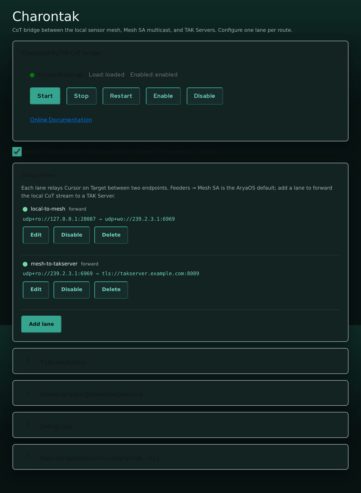
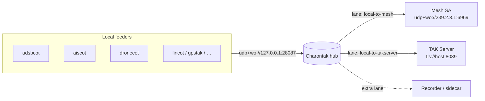

# Charontak lane editor

**Charontak** is the CoT hub at the center of AryaOS. Every local sensor gateway sends its [Cursor on Target (CoT)](../reference/glossary.md) to Charontak, and Charontak fans that single stream out to wherever it needs to go — the local Mesh SA multicast group, one or more TAK Servers, or other tools. The **Charontak** Cockpit plugin edits `/etc/charontak.ini` through a structured **lane editor** so you rarely have to touch the INI by hand.

Open it from Cockpit → **Charontak**.



## Concept: one hub, many lanes

AryaOS routes CoT in two tiers:



- Feeders publish to the hub's **ingress** at `udp+wo://127.0.0.1:28087`.
- Charontak **listens** on that address and owns **egress**.
- Each **lane** is a `[lane:*]` section in `/etc/charontak.ini` that relays CoT between two endpoints.

The image ships two lanes:

| Lane | Default state | Flow |
|------|--------------|------|
| `local-to-mesh` | **enabled** | `udp+ro://127.0.0.1:28087` → `udp+wo://239.2.3.1:6969` |
| `local-to-takserver` | disabled (template) | `udp+ro://127.0.0.1:28087` → `tls://takserver.example.com:8089` |

!!! warning "Charontak needs at least one lane"
    If no lanes are configured, Charontak exits at startup. The editor warns you when the lane list is empty.

## The lane list

The **Bridge lanes** card lists every lane with a status dot (on/off), its name, mode, and a one-line flow summary (`ingress → egress`). Each lane has **Edit**, **Enable / Disable**, and **Delete** buttons.

- **Enable / Disable** flips the lane's `enabled` flag and saves immediately.
- **Delete** removes the lane's section from the file (with a confirmation).

Adding or editing a lane opens the lane editor form.

## Adding or editing a lane

Press **Add lane** (or **Edit** on an existing lane) to open the editor.

| Field | INI key | Notes |
|-------|---------|-------|
| Lane name | *(section name)* | New lanes only. Lowercase letters, digits, `.`, `-`, `_`; must be unique |
| Enabled | `enabled` | Whether the lane runs |
| Mode | `mode` | `forward`, `reverse`, or `duplex` (see below) |
| Ingress CoT URL | `ingress_cot_url` | Local side |
| Egress CoT URL | `egress_cot_url` | Remote side |
| Suppress hello event | `PYTAK_NO_HELLO` | Recommended `true` for bridges |
| TAK protocol | `TAK_PROTO` | Payload framing; inherited unless set |
| *TLS fields* | `PYTAK_TLS_*` | Appear when a TLS scheme is used (below) |

A new lane pre-fills the ingress with the AryaOS hub address `udp+ro://127.0.0.1:28087` and enables **Suppress hello event** — the sensible defaults for a bridge.

!!! note "Ingress vs egress"
    - **Ingress** is the *local* side: where the lane reads CoT from. On AryaOS that is normally the hub, `udp+ro://127.0.0.1:28087`, where feeders publish.
    - **Egress** is the *remote* side: where the lane writes CoT to — Mesh SA (`udp+wo://239.2.3.1:6969`), a TAK Server (`tls://host:8089`), or a `tak://` enrollment URL.

    Both are required. Empty keys are removed so the lane falls back to the `[charontak]` global defaults.

### Modes

The **Mode** selector controls which direction CoT flows between the two URLs:

| Mode | Direction | Flow shown |
|------|-----------|-----------|
| `forward` | ingress → egress | `ingress → egress` |
| `reverse` | egress → ingress | `egress → ingress` |
| `duplex` | both directions | `ingress ⇄ egress` |

Most AryaOS lanes are **forward**: read from the local hub, write to the remote destination.

### Suppress hello event (`PYTAK_NO_HELLO`)

Enable this on bridge lanes so Charontak does **not** inject its own presence "hello" event into the stream. It is on by default for new lanes and for the shipped lanes.

### TAK protocol (`TAK_PROTO`)

Sets the payload framing for the lane. Leave as **inherited / default** unless the peer requires a specific value:

- `0` — XML
- `1` — Mesh protobuf
- `2` — Stream protobuf

The default for all lanes can be set in the collapsible **Global defaults ([charontak] section)** card, which also holds `DEBUG`, `CONNECT_RETRY_SLEEP`, `MAX_IN_QUEUE`, and `MAX_OUT_QUEUE`. Values there are inherited by every lane unless the lane overrides them.

## Per-lane TLS

When either the ingress or egress URL uses a TLS scheme (`tls://`, `ssl://`, `tak://`) — or when any TLS field is already set — the editor reveals a **TLS client identity** fieldset:

| Field | INI key |
|-------|---------|
| Client certificate | `PYTAK_TLS_CLIENT_CERT` |
| Client key | `PYTAK_TLS_CLIENT_KEY` |
| CA bundle | `PYTAK_TLS_CLIENT_CAFILE` |
| Key password | `PYTAK_TLS_CLIENT_PASSWORD` |
| Skip certificate verification | `PYTAK_TLS_DONT_VERIFY` |
| Skip hostname check | `PYTAK_TLS_DONT_CHECK_HOSTNAME` |

These are **per-lane**, so one Charontak instance can hold different client identities for different TAK Servers. The paths point at PEM files on the device (for example `/etc/charontak/tls/client.crt`).

!!! danger "Verification switches are testing only"
    `PYTAK_TLS_DONT_VERIFY` and `PYTAK_TLS_DONT_CHECK_HOSTNAME` disable TLS safety checks. Never leave them enabled in the field.

!!! tip "Let the AryaOS Site page do it"
    You usually do not fill the TLS fields by hand. The **TAK connection** card on the [AryaOS Site page](./aryaos-site.md#tak-connection) imports a data package or `tak://` enrollment URL and configures the TAK Server lane and its certs for you.

## Validation

The editor validates lanes in the browser using the **same rules Charontak applies at startup**, so it rejects exactly what the daemon would reject — you find out before you save, not after the service fails.

### Supported CoT URL schemes

The ingress and egress URLs must use a scheme PyTAK understands:

| Scheme | Use |
|--------|-----|
| `tcp://` | Outbound TCP client (e.g. `tcp://host:8087`) |
| `udp://`, `udp+wo://`, `udp+ro://`, `udp+broadcast://` | UDP — write-only (`+wo`), read-only listen (`+ro`), or broadcast |
| `tls://`, `ssl://`, `tak://` | TLS / TAK Server / enrollment |
| `log://`, `file://` | Logging / file output |

An unsupported scheme is rejected with a message pointing at the [PyTAK configuration docs](https://pytak.rtfd.io/en/stable/configuration/). Note in particular:

!!! warning "No TCP listen"
    PyTAK does not support inbound `tcp+…://` listen schemes — only outbound `tcp://` (client). If you need local feeders to reach a listener, point them at a `udp+ro://` mesh instead.

### Loopback UDP must be directional

A bidirectional `udp://` on loopback is ambiguous. To listen for local CoT senders on a loopback port, use `udp+ro://127.0.0.1:<port>` (or `udp+ro://:<port>`) — the editor flags a bare `udp://127.0.0.1:<port>` and tells you the fix. A bare all-interfaces `udp://:<port>` is auto-normalized to `udp+ro://`.

### UDP bind-conflict checks

Two enabled lanes cannot both **bind** the same UDP endpoint (host + port). When you save, the editor computes the bind endpoints of every enabled lane — the ingress of `forward`/`duplex` lanes and the egress of `reverse`/`duplex` lanes — and refuses the save if any two collide, naming the conflicting lanes and sides. Give each lane a distinct UDP ingress/egress bind, or disable the extra lane.

## Raw INI escape hatch

For anything the structured editor does not manage, the **Raw configuration** card exposes `/etc/charontak.ini` for direct editing. The lane editor only touches the keys it owns and preserves everything else, so you can mix structured edits with hand-written keys. After a raw save, Charontak restarts to pick up the change.

## After you save

Saving through the plugin restarts `charontak` for you. If you edit the INI over SSH instead, restart it manually:

```bash
sudo systemctl restart charontak
```

## See also

- [Connect to a TAK Server](../deploy/connect-tak-server.md) — end-to-end TAK Server setup
- [Relay & routing](../deploy/relay-routing.md) — routing patterns and courses of action
- [Site configuration](../config/site-config.md) — the feeder-side `COT_URL`
- [AryaOS Site page](./aryaos-site.md) — one-click TAK connection
