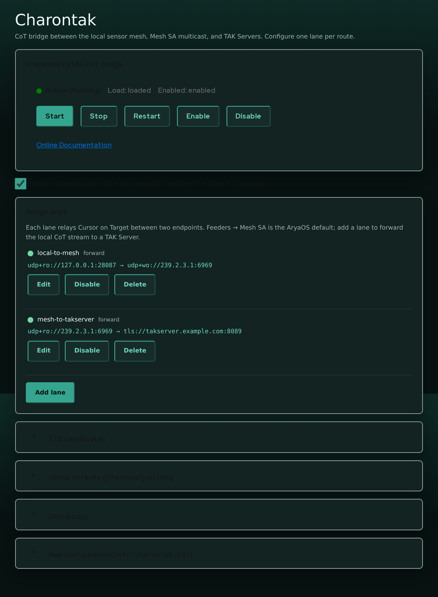
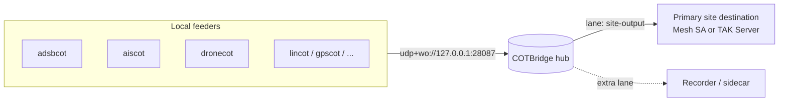

# COTBridge lane editor

**COTBridge** is the CoT hub at the center of AryaOS. Every local sensor gateway sends its [Cursor on Target (CoT)](../reference/glossary.md) to COTBridge. COTBridge sends that stream to Mesh SA, TAK Servers, or other tools. The **COTBridge** Cockpit plugin edits `/etc/cotbridge.ini` through a structured **lane editor** so you rarely have to touch the INI by hand.

Open it from Cockpit > **COTBridge**.



## Concept: one hub, many lanes

AryaOS routes CoT in two tiers:



- Feeders publish to the hub's **ingress** at `udp+wo://127.0.0.1:28087`.
- COTBridge **listens** on that address and owns **egress**.
- Each **lane** is a `[lane:*]` section in `/etc/cotbridge.ini` that relays CoT between two endpoints.

The image ships one operator-facing lane:

| Lane | Default state | Flow |
|------|--------------|------|
| `site-output` | **enabled** | `udp+ro://127.0.0.1:28087` > the site-wide output URL. Mesh SA by default |

Change the primary destination from **Cockpit > AryaOS Site > TAK destination**.
Use this lane editor only when an advanced deployment needs extra destinations,
nonstandard ingress, or per-lane overrides. Upgrades disable the retired
`local-to-mesh`, `local-to-takserver`, and `mesh-to-takserver` sections so old
configuration cannot duplicate events.

!!! warning "COTBridge needs at least one lane"
    If no lanes are configured, COTBridge exits at startup. The editor warns you when the lane list is empty.

## The lane list

The **Bridge lanes** card lists each lane with its status, name, mode, and flow. Each lane has **Edit**, **Enable / Disable**, and **Delete** buttons.

- **Enable / Disable** flips the lane's `enabled` flag and saves immediately.
- **Delete** removes the lane's section from the file (with a confirmation).

Adding or editing a lane opens the lane editor form.

## Adding or editing a lane

Press **Add lane** (or **Edit** on an existing lane) to open the editor.

| Field | INI key | Notes |
|-------|---------|-------|
| Lane name | *(section name)* | New lanes only. Lowercase letters, digits, `.`, `-`, `_`. Must be unique |
| Enabled | `enabled` | Whether the lane runs |
| Mode | `mode` | `forward`, `reverse`, or `duplex` (see below) |
| Ingress CoT URL | `ingress_cot_url` | Local side |
| Egress CoT URL | `egress_cot_url` | Remote side |
| Suppress hello event | `PYTAK_NO_HELLO` | Recommended `true` for bridges |
| TAK protocol | `TAK_PROTO` | Payload framing. inherited unless set |
| *TLS fields* | `PYTAK_TLS_*` | Appear when a TLS scheme is used (below) |

A new lane pre-fills the ingress with the AryaOS hub address `udp+ro://127.0.0.1:28087` and enables **Suppress hello event** - the sensible defaults for a bridge.

!!! note "Ingress vs egress"
    - **Ingress** is the *local* side: where the lane reads CoT from. On AryaOS that is normally the hub, `udp+ro://127.0.0.1:28087`, where feeders publish.
    - **Egress** is the *remote* side: where the lane writes CoT to. Mesh SA (`udp+wo://239.2.3.1:6969`) or a TAK Server (`tls://host:8089`). Import a one-time `tak://` enrollment URL from the AryaOS Site page. It resolves that URL to a persistent TLS destination and certificate set.

    Both are required. Empty keys are removed so the lane falls back to the `[cotbridge]` global defaults.

### Modes

The **Mode** selector controls which direction CoT flows between the two URLs:

| Mode | Direction | Flow shown |
|------|-----------|-----------|
| `forward` | ingress > egress | `ingress > egress` |
| `reverse` | egress > ingress | `egress > ingress` |
| `duplex` | both directions | `ingress ⇄ egress` |

Most AryaOS lanes are **forward**: read from the local hub, write to the remote destination.

### Suppress hello event (`PYTAK_NO_HELLO`)

Enable this on bridge lanes so COTBridge does **not** inject its own presence "hello" event into the stream. It is on by default for new lanes and for the shipped lane.

### TAK protocol (`TAK_PROTO`)

Sets the payload framing for the lane. Leave as **inherited / default** unless the peer requires a specific value:

- `0` - XML
- `1` - Mesh protobuf
- `2` - Stream protobuf

Set lane defaults in the collapsible **Global defaults ([cotbridge] section)** card. It contains
`DEBUG`, `CONNECT_RETRY_SLEEP`, `MAX_IN_QUEUE`, and `MAX_OUT_QUEUE`. Each lane inherits these values
unless it defines an override.

## Per-lane TLS

When a URL uses a TLS scheme, the editor shows a **TLS client identity** fieldset:

| Field | INI key |
|-------|---------|
| Client certificate | `PYTAK_TLS_CLIENT_CERT` |
| Client key | `PYTAK_TLS_CLIENT_KEY` |
| CA bundle | `PYTAK_TLS_CLIENT_CAFILE` |
| Key password | `PYTAK_TLS_CLIENT_PASSWORD` |
| Skip certificate verification | `PYTAK_TLS_DONT_VERIFY` |
| Skip hostname check | `PYTAK_TLS_DONT_CHECK_HOSTNAME` |

These are **per-lane**, so one COTBridge instance can hold different client identities for different TAK Servers. The paths point at PEM files on the device (for example `/etc/cotbridge/tls/client.crt`).

!!! danger "Verification switches are testing only"
    `PYTAK_TLS_DONT_VERIFY` and `PYTAK_TLS_DONT_CHECK_HOSTNAME` disable TLS safety checks. Never leave them enabled in the field.

!!! tip "Let the AryaOS Site page do it"
    You usually do not fill the TLS fields by hand. The **TAK connection** card imports a package or enrollment URL. It then configures the `site-output` lane and its certificates.

## Validation

The editor uses the **same validation rules that COTBridge uses at startup**. It rejects the same invalid values before you save them.

### Supported CoT URL schemes

The ingress and egress URLs must use a scheme PyTAK understands:

| Scheme | Use |
|--------|-----|
| `tcp://` | Outbound TCP client (e.g. `tcp://host:8087`) |
| `udp://`, `udp+wo://`, `udp+ro://`, `udp+broadcast://` | UDP - write-only (`+wo`), read-only listen (`+ro`), or broadcast |
| `tls://`, `ssl://`, `tak://` | TLS / TAK Server / enrollment |
| `log://`, `file://` | Logging / file output |

An unsupported scheme is rejected with a message pointing at the [PyTAK configuration docs](https://pytak.rtfd.io/en/stable/configuration/). Note in particular:

!!! warning "No TCP listen"
    PyTAK does not support inbound `tcp+...://` listen schemes. Only outbound `tcp://` (client). If you need local feeders to reach a listener, point them at a `udp+ro://` mesh instead.

### Loopback UDP must be directional

A bidirectional `udp://` on loopback is ambiguous. To listen for local CoT senders on a loopback port, use `udp+ro://127.0.0.1:<port>` (or `udp+ro://:<port>`). The editor flags a bare `udp://127.0.0.1:<port>` and tells you the fix. A bare all-interfaces `udp://:<port>` is auto-normalized to `udp+ro://`.

### UDP bind-conflict checks

Two enabled lanes cannot both **bind** the same UDP endpoint (host + port). When you save, the editor computes the bind endpoints of every enabled lane. It checks the ingress and egress endpoints. The editor rejects collisions and names both lanes. Give each lane a distinct UDP ingress/egress bind, or disable the extra lane.

## Raw INI escape hatch

For anything the structured editor does not manage, the **Raw configuration** card exposes `/etc/cotbridge.ini` for direct editing. The lane editor only touches the keys it owns and preserves everything else. Thus, you can mix structured edits with hand-written keys. After a raw save, COTBridge restarts to pick up the change.

## After you save

Saving through the plugin restarts `cotbridge` for you. If you edit the INI over SSH instead, restart it manually:

```bash
sudo systemctl restart cotbridge
```

## See also

- [Connect to a TAK Server](../deploy/connect-tak-server.md) - end-to-end TAK Server setup
- [Relay & routing](../deploy/relay-routing.md) - routing patterns and courses of action
- [Site configuration](../config/site-config.md) - the feeder-side `COT_URL`
- [AryaOS Site page](./aryaos-site.md) - one-click TAK connection
