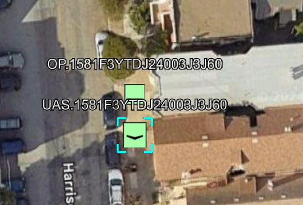
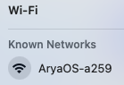
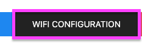
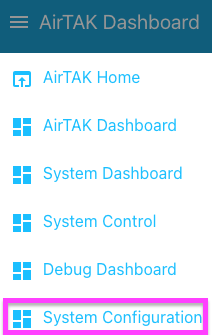
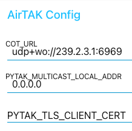

# AirTAK C-UAS Getting Started

AirTAK C-UAS should operate plug & play out of the box with nothing more than a TAK EUD (ATAK, WinTAK, iTAK) connected to AirTAK C-UAS's WiFi hotspot.

* When in-doubt, reboot.

## Initial setup
### Using WiFi

This method uses AirTAK C-UAS' built-in WiFi hotspot to reconfigure the device to connect to an existing WiFi network, disabling the on-board WiFi hotspot.

1. Connect the USB power supply to the device. Ensure color-coded direction of connector (yellow to yellow, black to black).
2. After a 2 minutes, a new WiFi network should appear with a name like `AryaOS-XXXX`. Connect to this network. 
  
    

3. From a web browser (Chrome, Safari), browse to: [http://aryaos.local](http://aryaos.local) (or [http://10.41.0.1](http://10.41.0.1)). 
4. Click WiFi Configuration:

    

5. Select the WiFi network you'd like AirTAK C-UAS to connect to:

    

6. Enter Password and click Connect:

    

Once you've connected AirTAK C-UAS to a WiFi network, the `AryaOS-XXXX` hotspot AP will no longer broadcast an SSID. You can access the device dashboard by accessing its IP address, for example, if your WiFi network is using DHCP and has given AirTAK C-UAS an IP of 192.168.0.3, you'll browse to: [http://192.168.0.3](http://192.168.0.3).

### Using Ethernet

This method uses the built-in Ethernet port to connect to an existing network.

1. Connect the USB power supply to the device. Ensure color-coded direction of connector (yellow to yellow, black to black).
2. Connect an ethernet cable to the external ethernet port of the AirTAK.
3. From a web browser (Chrome, Safari), browse to: [http://aryaos.local](http://aryaos.local)

Once you've connected AirTAK C-UAS to your ethernet network, you can access the device via its IP address, for example, if your ethernet network is using DHCP and has given AirTAK C-UAS an IP of 192.168.0.3, you'll browse to: [http://192.168.0.3](http://192.168.0.3).

## Connecting an EUD

AirTAK C-UAS has been tested with all TAK Products, including iTAK, WinTAK & ATAK. Out-of-the-box, the device will transmit Cursor on Target CoT to the multicast Mesh SA group of 239.2.3.1:6969. The destination for CoT can be changed by accessing the AirTAK C-UAS dashboard at [http://aryaos.local](http://aryaos.local) or [http://10.41.0.1](http://10.41.0.1).

# Connect to a TAK Server over TLS

1. Combine PEM client cert & PEM unencrypted client key into a single `combined.pem`:

        cat client.pem > combined.pem
        openssl rsa -in client.key -out client.key.plain
        cat client.key.pem >> combined.pem

2. Using sftp, scp, pftp or other file-copy tool, copy `combined.pem` to `/etc/combined.pem` on the AirTAK.
3. Browse to the AirTAK C-UAS dashboard: [http://aryaos.local](http://aryaos.local) (or IP:1880/ui).
4. Select **ARYAOS DASHBOARDS**: 

    

5. Under the **AirTAK Dashboards** hamburger menu, select **System Configuration**:

    

6. Under **AirTAK Config**, change `COT_URL` to the URL of your TAK Server, for example: `tls://takserver.example.com:8089`, and change `PYTAK_TLS_CLIENT_CERT` to the path to your combined PEM TLS Client Cert & unecrypted Key.

    

7. Click **Save Changes & Restart**.

    

# Updating AirTAK / AryaOS

TK