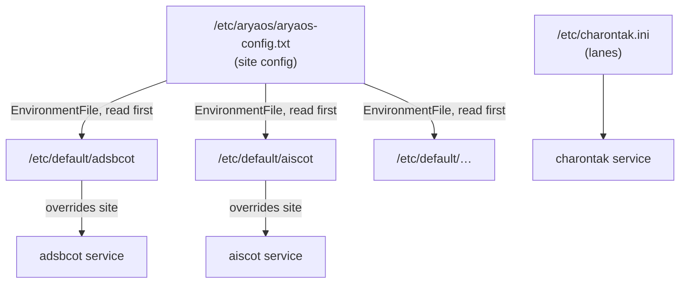

# Configuration model

AryaOS has a simple, layered configuration model: a **single site file** sets defaults for the whole device, and each sensor service can **override** those defaults locally. Understanding this one rule tells you where every setting lives and which surface to edit.

## The inheritance model

Each gateway's systemd unit loads the **site config first**, then its own **`/etc/default/<svc>`** file. Because the per-service file is read second, **a value set per-service wins**; anything left unset falls through to the site default.

!!! example "One place sets the CoT hub for everyone"
    The site config sets `COT_URL=udp+wo://127.0.0.1:28087`. Every feeder inherits it, so out of the box they all send [Cursor on Target (CoT)](../reference/glossary.md) to the Charontak hub — no per-service configuration needed. This is the AryaOS routing invariant: **feeders → charontak → Mesh SA / TAK Server**.

## Where each thing lives

| What | File | Edit in |
|------|------|---------|
| Site-wide TAK destination, decoder, roles, identity, Bluetooth PAN | `/etc/aryaos/aryaos-config.txt` | [AryaOS Site page](../admin/aryaos-site.md) |
| Site-wide TLS client certs | `/etc/aryaos/tls/` | [AryaOS Site page](../admin/aryaos-site.md#site-wide-tak-tls-certificates) |
| Upstream CoT lanes (Mesh SA, TAK Server, tools) | `/etc/charontak.ini` | [Charontak lane editor](../admin/charontak-lanes.md) |
| Per-gateway tuning | `/etc/default/<svc>` | [Gateway pages](../admin/gateways.md) |
| Onboarding hotspot | `/etc/comitup.conf` | [AryaOS Site page](../admin/aryaos-site.md#onboarding-hotspot-password) |

## Edit in the UI, not the files

Everything above can be edited in the web console — you should not need SSH or a text editor for normal configuration. As a rule:

- **Site-wide behavior** (TAK destination, decoder, role, radios, TLS) → [AryaOS Site page](../admin/aryaos-site.md).
- **Where CoT goes upstream** (mesh, TAK Server, fan-out) → [Charontak lane editor](../admin/charontak-lanes.md).
- **One service's own knobs** → that [gateway's page](../admin/gateways.md).

Each editor writes the underlying file for you, preserving comments and any keys it does not manage. If you *do* edit a file directly (over SSH or with Cockpit's file editor), restart the affected units afterward — for example `sudo systemctl restart charontak adsbcot aiscot lincot`.

## The three configuration references

- :material-file-cog: **Site configuration** — Every key in `/etc/aryaos/aryaos-config.txt`: the TAK/CoT destination, ADS-B decoder, network binding, Bluetooth PAN, role, and device identity. [Reference](./site-config.md)

- :material-account-switch: **Device roles** — The five roles, exactly which sensor units each enables, and how the CoT core always stays up. [Roles](./device-roles.md)

- :material-radio-tower: **Radios & SDRs** — The `stx:1090:0` / `stx:978:0` serial convention, re-serializing dongles, decoder selection, and multi-SDR setups. [Radios](./radios-sdr.md)

