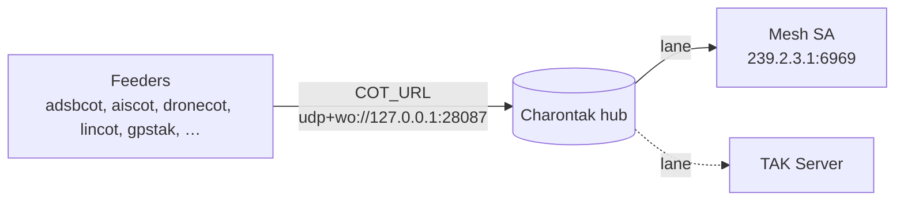

# Site configuration

`/etc/aryaos/aryaos-config.txt` is the **site configuration** file: the site-wide defaults inherited by every PyTAK sensor gateway on the device. This page is the complete key reference. Edit it through the [AryaOS Site page](../admin/aryaos-site.md) — the form updates known keys in place and preserves comments and everything else — or, for keys the form does not surface, through that page's **Raw site config** editor.

!!! info "How it is applied"
    Each gateway's systemd unit loads this file via `EnvironmentFile=` **before** its own `/etc/default/<svc>`, so these are *defaults*: a per-service value overrides the site value. See the [configuration model](./index.md).

## The CoT routing invariant

The single most important thing this file sets is where local feeders send CoT — and the AryaOS default keeps them all flowing through one hub:



**Feeders → Charontak → Mesh SA (and/or TAK Server).** Keep `COT_URL` pointed at the Charontak hub and configure upstream destinations as [Charontak lanes](../admin/charontak-lanes.md). Only change `COT_URL` when you are deliberately bypassing the hub.

## TAK / CoT

| Key | Default | Meaning |
|-----|---------|---------|
| `COT_URL` | `udp+wo://127.0.0.1:28087` | Where local `*cot` feeders send CoT. Default is the Charontak hub ingress on localhost. Upstream mesh / TAK Server forwarding is configured in `/etc/charontak.ini`. |
| `COT_HOST_ID` | *(set on first boot)* | Functional source id stamped into CoT flow-tags and remarks by the PyTAK tools. Set on first boot to `aryaos-<suffix>`; override for a custom name. |

TLS material for TAK Server connections is written to this file by the [Site-wide TAK TLS certificates](../admin/aryaos-site.md#site-wide-tak-tls-certificates) card as `PYTAK_TLS_CLIENT_CERT`, `PYTAK_TLS_CLIENT_KEY`, and `PYTAK_TLS_CLIENT_CAFILE` (paths under `/etc/aryaos/tls/`), plus `PYTAK_TLS_DONT_VERIFY` (lab only). Prefer the [TAK connection](../admin/aryaos-site.md#tak-connection) card, which sets these for you.

## ADS-B / radios

| Key | Default | Meaning |
|-----|---------|---------|
| `ARYAOS_ADSB_DECODER` | `readsb` | 1090 MHz decoder: `readsb` or `dump1090_fa` (only one may run). Must match the image build. Changing this alone does not reconfigure systemd — re-apply the [device role](./device-roles.md). |
| `ARYAOS_ADSB_JSON_DIR` | `/run/adsb` | Directory where the decoder writes `aircraft.json`; `adsbcot` reads `aircraft.json` from here. |
| `ARYAOS_UAT_RTL_SERIAL` | `stx:978:0` | RTL-SDR EEPROM serial for `dump978-fa` (UAT / 978 MHz). Must differ from the 1090 MHz serial. Restart `dump978-fa` after changing. |

See [Radios & SDRs](./radios-sdr.md) for the serial conventions and decoder-switch procedure.

## Network

| Key | Default | Meaning |
|-----|---------|---------|
| `PYTAK_MULTICAST_LOCAL_ADDR` | `10.41.0.1` | For Mesh SA / multicast `COT_URL`s: which interface to bind. An IP, or `0.0.0.0` for all. Default is the Wi-Fi AP IP. |
| `WIFI_AP_IP` | `10.41.0.1` | **Deprecated** legacy setting. |
| `AOS_SERVICES` | `"charontak gpstak aiscot lincot adsbcot dronecot adsbxcot aprscot spotcot"` | Network-facing CoT services restarted on network-state change and by **Save & restart sensors**. Keep local decoders, GPS, UI, and the Bluetooth bridge out of this list. |

!!! note "AOS_SERVICES and the Site page"
    The **Sensor services** card and the **Save & restart sensors** button use `AOS_SERVICES` when it is set. Restarting the wrong units during boot can interrupt radio ingest and Bluetooth pairing, which is why the list deliberately excludes decoders, gpsd, and the PAN bridge.

## Bluetooth PAN

AryaOS acts as a Bluetooth Network Access Point (NAP) so a paired phone can reach AryaOS services over Bluetooth. It serves DHCP on the PAN link; **no NAT or forwarding** is enabled. See [Bluetooth PAN](../bluetooth-pan.md).

| Key | Default | Meaning |
|-----|---------|---------|
| `BT_PAN_ENABLED` | `1` | Enable the Bluetooth PAN. |
| `BT_PAN_BRIDGE` | `pan0` | Bridge interface name. |
| `BT_PAN_ADDRESS` | `10.44.0.1` | AryaOS address on the PAN. |
| `BT_PAN_PREFIX` | `24` | PAN subnet prefix length. |
| `BT_PAN_DHCP_START` | `10.44.0.20` | First DHCP address handed to phones. |
| `BT_PAN_DHCP_END` | `10.44.0.60` | Last DHCP address. |
| `BT_PAN_DHCP_LEASE` | `12h` | DHCP lease time. |

## Role

| Key | Default | Meaning |
|-----|---------|---------|
| `ARYAOS_ROLE` | `multi` (when unset) | The device's sensor role, persisted by `aryaos-role set`. Selects which sensor pipelines run. |

Set this from the [Device role](../admin/aryaos-site.md#device-role) card. The full role-to-units mapping is in [Device roles](./device-roles.md).

## Device identity

!!! danger "Do not modify identity keys"
    These are set on first boot by `aryaos-firstboot.sh`. The comment in the file reads *"do not modify. NO STEP."*

| Key | Default | Meaning |
|-----|---------|---------|
| `DEVICE_SUFFIX` | *(set on first boot)* | Last 4 hex of the machine-id (or MAC). Drives the hostname `aryaos-xxxx` and Wi-Fi SSID `AryaOS-xxxx`. |

## Changing the CoT destination

For the normal case, leave `COT_URL` alone and edit lanes:

=== "Recommended (via Charontak)"
    Point upstream destinations at the [Charontak lane editor](../admin/charontak-lanes.md). Feeders keep `COT_URL=udp+wo://127.0.0.1:28087`; Charontak forwards to Mesh SA and/or a TAK Server. For TAK Servers, the [TAK connection](../admin/aryaos-site.md#tak-connection) card wires the lane and certs automatically.

=== "Bypass Charontak (advanced)"
    Set `COT_URL` directly on the Site page (or per-gateway) to route feeders around the hub — for example `tls://takserver.example.com:8089` or `udp+wo://239.2.3.1:6969`. This forgoes Charontak's fan-out and is normally used only for debugging.

## Editing over SSH

If you edit the file directly instead of using the web console, restart the affected units afterward:

```bash
sudo systemctl restart charontak adsbcot aiscot lincot dronecot
```

Prefer the [AryaOS Site page](../admin/aryaos-site.md), which restarts the right services for you.
