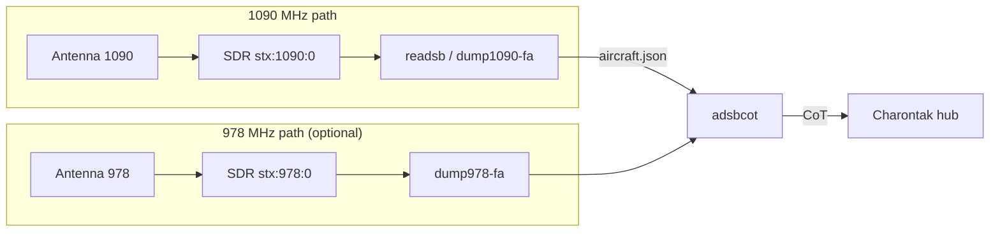

# Aircraft via ADS-B & UAT

Turn AryaOS into a standalone airspace picture: attach an SDR and antenna, select the **`air`** role, and crewed aircraft appear on ATAK/WinTAK/iTAK as native Cursor on Target (CoT) tracks.

Aircraft broadcast their position on two frequencies:

- **1090 MHz — ADS-B (Mode S Extended Squitter).** The global standard; airliners and most turbine aircraft.
- **978 MHz — UAT (Universal Access Transceiver).** A US-only band used by many general-aviation aircraft below 18,000 ft.

AryaOS decodes both and feeds them to your COP through `adsbcot`.

## Hardware

| Part | Notes |
|------|-------|
| RTL-SDR (RTL2832U) dongle | One per band. `readsb`, `dump1090-fa`, and `dump978-fa` all use RTL-SDR. |
| 1090 MHz antenna | A tuned 1090 MHz ADS-B antenna beats a stock whip by a wide margin. |
| 978 MHz antenna | Only if you decode UAT; use a separate SDR + antenna for the second band. |
| Low-loss coax + optional LNA/filter | A 1090 MHz SAW filter/LNA reduces out-of-band overload near cities. |

!!! tip "Range in the field"
    Range is line-of-sight and antenna-limited. In a backpack CONOP with a modest antenna, **55 miles** was achieved on a clear day in San Diego (see [Introduction](../get-started/overview.md)). Height and a clear horizon matter more than gain.

## Turn on the air role

=== "Web console"

    1. Open **Cockpit → AryaOS Site** (browse to `https://<host>/admin/` or `https://aryaos.local`).
    2. In the **Device role** card, choose **Air — ADS-B 1090/978 aircraft**.
    3. Click **Apply role**.

    AryaOS enables the ADS-B decoder, `dump978-fa`, `adsbcot`, and `gdltak`, and stops the maritime and drone pipelines.

=== "Command line"

    ```bash
    sudo aryaos-role set air
    ```

    ```bash
    aryaos-role list   # JSON: current role + each role's units
    ```

## Choose the ADS-B decoder

AryaOS ships two 1090 MHz decoders; **exactly one** runs at a time, selected by `ARYAOS_ADSB_DECODER` in the site config:

| Value | Decoder | Notes |
|-------|---------|-------|
| `readsb` | `readsb` | Default. Broad SDR support (RTL-SDR / SoapySDR / HackRF). `apt-mark hold` so updates don't change it under you. |
| `dump1090_fa` | `dump1090-fa` | FlightAware's decoder. |

Set it from the **TAK destination** card's **ADS-B decoder** dropdown, or edit `ARYAOS_ADSB_DECODER` directly.

!!! warning "A decoder switch needs a role re-apply"
    Changing `ARYAOS_ADSB_DECODER` alone does not reconfigure systemd. Re-apply the role (`aryaos-role set air`, or **Apply role** in the console) so the unused decoder is disabled and the chosen one is enabled. Both decoders write aircraft JSON to `ARYAOS_ADSB_JSON_DIR` (default `/run/adsb`), which `adsbcot` reads.

## SDR serials (dual-SDR setups)

AryaOS selects dongles by their **EEPROM serial** so the right SDR handles the right band, even when several are plugged in:

| Band | Serial | Used by |
|------|--------|---------|
| ADS-B 1090 MHz | `stx:1090:0` | `readsb` / `dump1090-fa` |
| UAT 978 MHz | `stx:978:0` | `dump978-fa` (via `ARYAOS_UAT_RTL_SERIAL`) |

The 978 MHz serial is configurable from the **UAT (978 MHz) RTL-SDR serial** field on the **TAK destination** card, or via `ARYAOS_UAT_RTL_SERIAL` in the site config (default `stx:978:0`, which matches the Nooelec NESDR Nano 3 "978" EEPROM preset).

!!! danger "Never share a serial between bands"
    The 978 MHz SDR must not use the same serial as the 1090 MHz path, or the decoders will fight over the same dongle. If your dongles ship blank or duplicated, re-serial them from the **Radios** card or with `aryaos-sdr set-serial IDX SERIAL`. Writing a serial briefly stops SDR services — **replug the dongle (or reboot)** before the new serial is visible.

For SDR discovery, EEPROM re-serialing, and antenna wiring, see the [Radios](../config/radios-sdr.md) page.

## Single vs. dual SDR



- **One SDR (1090 only):** the most common setup. Decode ADS-B; leave `dump978-fa` idle (no UAT antenna).
- **Two SDRs (1090 + 978):** add a second dongle serialed `stx:978:0` and a 978 MHz antenna to also see UAT traffic.

## Verify tracks

1. Connect your EUD to the AryaOS Wi-Fi hotspot (`AryaOS-xxxx`) or the same network.
2. Open ATAK/WinTAK/iTAK — with Mesh SA enabled, aircraft appear automatically.
3. On the box, confirm the pipeline:

    ```bash
    systemctl status readsb adsbcot        # or dump1090-fa
    ls -l /run/adsb/aircraft.json          # ARYAOS_ADSB_JSON_DIR
    ```

    A growing, recently-modified `aircraft.json` means the decoder is receiving. `adsbcot` then converts those tracks to CoT and sends them to the Charontak hub at `udp+wo://127.0.0.1:28087`.

!!! tip "No aircraft yet?"
    Check the antenna connection first, then confirm the SDR serial matches the band. If nothing decodes even with good signal, verify the correct decoder is enabled for `ARYAOS_ADSB_DECODER` and re-apply the role.

## Related

- [Multi-sensor](./multi-sensor.md) — run air alongside maritime and drone.
- [ForeFlight / GDL90](./foreflight-gdl90.md) — the `air` role also serves the picture to EFB apps.
- [Connect a TAK Server](./connect-tak-server.md) — forward the air picture upstream.
- [Device roles](../config/device-roles.md) · [Glossary](../reference/glossary.md)
