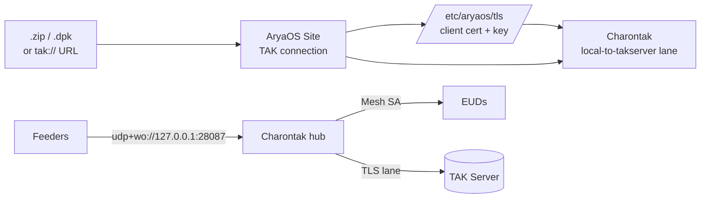

# Connect a TAK Server

Forward the AryaOS picture upstream. Import an ATAK connection **data package** or paste a **`tak://` enrollment URL** in the web console, and AryaOS provisions the certificates and turns on a Charontak lane to your TAK Server — no shell required.

By default AryaOS multicasts to **Mesh SA** (`udp+wo://239.2.3.1:6969`), which nearby EUDs pick up automatically. Connecting a TAK Server adds a **second** egress so the same picture reaches your server-side COP over the network.

## Two ways to connect

Both live on the **TAK connection** card in **Cockpit → AryaOS Site**. AryaOS installs the resulting certs under **`/etc/aryaos/tls`** and enables Charontak forwarding to the TAK Server.

=== "Import a data package"

    Use the same `.zip` / `.dpk` connection package you'd load into ATAK/iTAK.

    1. Open **Cockpit → AryaOS Site** → **TAK connection**.
    2. Under **Connection package (.zip / .dpk)**, choose your package file.
    3. Click **Import package**.

    AryaOS unpacks the client certificate and server details, stores the TLS material in `/etc/aryaos/tls`, and configures the Charontak TAK Server lane.

=== "Paste a tak:// enrollment URL"

    Use a one-time TAK Server enrollment URL (soft-cert enrollment).

    1. Open **Cockpit → AryaOS Site** → **TAK connection**.
    2. Paste the URL into **One-time enrollment URL**. It must start with `tak://`, e.g.

        ```text
        tak://com.atakmap.app/enroll?host=takserver.example.com&username=USER&token=TOKEN
        ```

    3. Click **Enroll**.

    AryaOS performs the enrollment, provisions the client cert under `/etc/aryaos/tls`, and updates Charontak forwarding. On success the card reports *"Enrolled &lt;host&gt;; Charontak forwarding updated."*

!!! tip "Check the status line"
    The **TAK connection** card shows whether enrollment is **configured** or **not configured**. Use **Refresh status** after importing to confirm.

## What gets provisioned



The enable of the Charontak `local-to-takserver` lane is what actually forwards CoT upstream:

```ini title="/etc/charontak.ini (TAK Server lane, provisioned)"
[lane:local-to-takserver]
enabled = true
mode = forward
ingress_cot_url = udp+ro://127.0.0.1:28087
egress_cot_url = tls://takserver.example.com:8089
PYTAK_NO_HELLO = true
```

Keep every local feeder's `COT_URL` pointed at the Charontak hub (`udp+wo://127.0.0.1:28087`) — you route to the TAK Server **from Charontak**, not from each feeder.

## Manual TLS lane (lane editor)

If you already have a `combined.pem` (client cert + unencrypted key) or want full control, configure the lane by hand in **Cockpit → Charontak**:

1. Combine a PEM client cert and unencrypted key into one file:

    ```bash
    cat client.pem > combined.pem
    openssl rsa -in client.key -out client.key.plain
    cat client.key.plain >> combined.pem
    ```

2. Copy `combined.pem` to the box (e.g. `/etc/aryaos/tls/combined.pem`).
3. In **Cockpit → Charontak**, open the `local-to-takserver` lane, set `egress_cot_url` to `tls://takserver.example.com:8089`, point the TLS paths at your PEM, and **Save Changes & Restart**.

!!! danger "Convert .p12 first"
    The console TLS uploads expect PEM. If you have a `.p12`/PFX, convert it with `openssl pkcs12` before importing. TLS private keys are never included in support bundles.

See [Charontak lanes](../admin/charontak-lanes.md) for the complete lane editor reference.

## Mesh SA vs. direct TAK Server

| | Mesh SA (default) | TAK Server lane |
|--|-------------------|-----------------|
| Transport | UDP multicast `239.2.3.1:6969` | TLS to your server (e.g. `:8089`) |
| Discovery | EUDs auto-join, no config | Server-side federation/COP |
| Network | Same L2 segment / MANET | Any routable network |
| Auth | None | Client certificate |
| Use when | Local team, disconnected ops | Enterprise COP, wide-area sharing |

The two are **not** exclusive — AryaOS commonly runs the Mesh SA lane **and** a TAK Server lane at the same time, so local EUDs and the server both get the picture.

## Related

- [Relay & routing](./relay-routing.md) — a box dedicated to forwarding CoT.
- [Charontak lanes](../admin/charontak-lanes.md) · [AryaOS Site](../admin/aryaos-site.md)
- [Offline backpack](./offline-backpack.md) · [Glossary](../reference/glossary.md)
