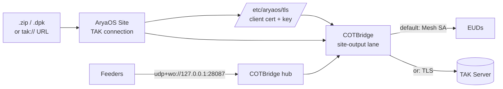

# Connect a TAK Server

Forward the AryaOS picture upstream. Import an ATAK connection **data package** or paste a **`tak://` enrollment URL** in the web console. AryaOS provisions the certificates and points the COTBridge site output at your TAK Server - no shell required.

By default AryaOS multicasts to **Mesh SA** (`udp+wo://239.2.3.1:6969`). This nearby EUDs pick up automatically. Connecting a TAK Server changes the primary site output to the persistent TLS URL returned by the connection package or enrollment flow.

## Two ways to connect

Both live on the **TAK connection** card in **Cockpit > AryaOS Site**. AryaOS installs the resulting certs under **`/etc/aryaos/tls`** and enables COTBridge forwarding to the TAK Server.

=== "Import a data package"

    Use the same `.zip` or `.dpk` connection package that you load into ATAK or iTAK.

    1. Open **Cockpit > AryaOS Site** > **TAK connection**.
    2. Under **Connection package (.zip / .dpk)**, choose your package file.
    3. Click **Import package**.

    AryaOS unpacks the client certificate and server details, stores the TLS material in `/etc/aryaos/tls`, and configures the COTBridge `site-output` lane.

=== "Paste a tak:// enrollment URL"

    Use a one-time TAK Server enrollment URL (soft-cert enrollment).

    1. Open **Cockpit > AryaOS Site** > **TAK connection**.
    2. Paste the URL into **One-time enrollment URL**. It must start with `tak://`, e.g.

        ```text
        tak://com.atakmap.app/enroll?host=takserver.example.com&username=USER&token=TOKEN
        ```

    3. Click **Enroll**.

    AryaOS performs the enrollment, provisions the client cert under `/etc/aryaos/tls`, and updates COTBridge forwarding. On success the card reports *"Enrolled &lt;host&gt; COTBridge forwarding updated."*

!!! tip "Check the status line"
    The **TAK connection** card shows whether enrollment is **configured** or **not configured**. Use **Refresh status** after importing to confirm.

## What gets provisioned


```mermaid
flowchart LR
    DP[.zip / .dpk<br/>or tak:// URL] --> AOS[AryaOS Site<br/>TAK connection]
    AOS --> TLS[/etc/aryaos/tls<br/>client cert + key/]
    AOS --> LANE[COTBridge<br/>site-output lane]
    Feeders -->|udp+wo://127.0.0.1:28087| H[COTBridge hub]
    H --> LANE
    LANE -->|default: Mesh SA| E[EUDs]
    LANE -->|or: TLS| S[(TAK Server)]
    TLS --> LANE
```

The COTBridge `site-output` lane is what actually forwards CoT upstream:

```ini title="/etc/cotbridge.ini (TAK Server lane, provisioned)"
[lane:site-output]
enabled = true
mode = forward
ingress_cot_url = udp+ro://127.0.0.1:28087
egress_cot_url = tls://takserver.example.com:8089
PYTAK_NO_HELLO = true
```

Keep every local feeder's `COT_URL` pointed at the COTBridge hub (`udp+wo://127.0.0.1:28087`) - you route to the TAK Server **from COTBridge**, not from each feeder.

## Manual TLS lane (lane editor)

If you already have a `combined.pem` (client cert + unencrypted key) or want full control, configure the lane by hand in **Cockpit > COTBridge**:

1. Combine a PEM client cert and unencrypted key into one file:

    ```bash
    cat client.pem > combined.pem
    openssl rsa -in client.key -out client.key.plain
    cat client.key.plain >> combined.pem
    ```

2. Copy `combined.pem` to the box (e.g. `/etc/aryaos/tls/combined.pem`).
3. In **Cockpit > COTBridge**, open the `site-output` lane, set `egress_cot_url` to `tls://takserver.example.com:8089`, point the TLS paths at your PEM, and **Save Changes & Restart**.

!!! danger "Convert .p12 first"
    The console TLS uploads expect PEM. If you have a `.p12`/PFX, convert it with `openssl pkcs12` before importing. TLS private keys are never included in support bundles.

See [COTBridge lanes](../admin/cotbridge-lanes.md) for the complete lane editor reference.

## Mesh SA vs. direct TAK Server

| | Mesh SA (default) | TAK Server output |
|--|-------------------|-----------------|
| Transport | UDP multicast `239.2.3.1:6969` | TLS to your server (e.g. `:8089`) |
| Discovery | EUDs auto-join, no config | Server-side federation/COP |
| Network | Same L2 segment / MANET | Any routable network |
| Auth | None | Client certificate |
| Use when | Local team, disconnected ops | Enterprise COP, wide-area sharing |

The AryaOS Site page manages one primary output. When both destinations are required, keep
`site-output` pointed at Mesh SA. Add an advanced `mesh-to-takserver` lane that reads the Mesh SA
multicast group and writes to the server. Do not give two lanes the same local UDP ingress. The lane
editor rejects that bind conflict.

## Related

- [Relay & routing](./relay-routing.md) - a box dedicated to forwarding CoT.
- [COTBridge lanes](../admin/cotbridge-lanes.md) · [AryaOS Site](../admin/aryaos-site.md)
- [Offline backpack](./offline-backpack.md) · [Glossary](../reference/glossary.md)
