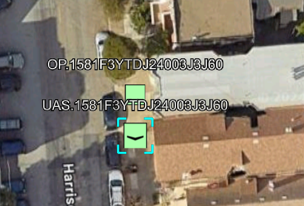
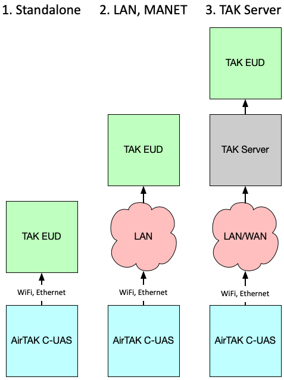
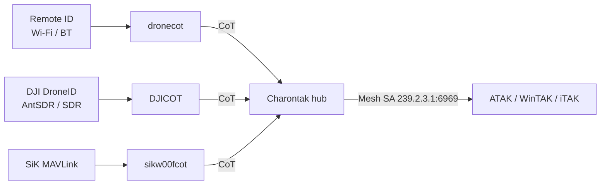

# Drones (Counter-UAS)

Detect and track drones for counter-UAS (C-UAS) awareness. Select the **`cuas`** role, attach a Remote ID receiver and/or a DJI DroneID SDR, and drones appear in ATAK/WinTAK/iTAK as native Cursor on Target (CoT) tracks — often complete with the operator's location.

{ width="640" }

AryaOS builds a C-UAS picture from two complementary detection sources:

- **Remote ID / Open Drone ID** — the FAA-mandated broadcast that compliant drones emit over Wi-Fi/Bluetooth. Decoded by **`dronecot`** (on-board Wi-Fi/BLE, or a dedicated receiver — see below).
- **DJI DroneID** — DJI's proprietary telemetry, received over the air with an SDR (for example an **AntSDR**) and decoded by **DJICOT**.

`sikw00fcot` additionally converts SiK-radio MAVLink drone telemetry to CoT when you have that link.

!!! info "Dedicated Remote ID receiver: DroneScout DS101"
    A **BlueMark DroneScout Bridge (DS101)** — a standards-based Remote ID receiver — plugs in over USB-serial and emits detected Remote ID as **MAVLink** (`OPEN_DRONE_ID_MESSAGE_PACK` or `ADSB_VEHICLE`). AryaOS ships a second, opt-in dronecot instance for it, **`dronecot-dronescout`**, that reads the MAVLink serial and feeds the same Charontak hub. Enable it on a DS101 box with `sudo systemctl enable --now dronecot-dronescout` (requires `dronecot` ≥ 2.2.3). This runs alongside the AntSDR/DJI and SiKW00F sources for a multi-source Remote ID picture.

!!! tip "Plug & play by design"
    AirTAK C-UAS is designed to work out of the box: power the device, connect a TAK EUD (ATAK, WinTAK, iTAK) to its Wi-Fi hotspot, and drone tracks flow with no extra configuration. *When in doubt, reboot.*

## Turn on the C-UAS role

=== "Web console"

    1. Open **Cockpit → AryaOS Site** (`https://<host>/admin/` or `https://aryaos.local`).
    2. In the **Device role** card, choose **C-UAS — drone detection**.
    3. Click **Apply role**.

    AryaOS enables `dronecot` and `sikw00fcot`, and stops the air and maritime pipelines.

=== "Command line"

    ```bash
    sudo aryaos-role set cuas
    ```

## Three CONOP modes

An AirTAK C-UAS can run in one of three connectivity modes:

{ width="640" }

1. **Standalone.** One or more EUDs connect directly to the AirTAK Wi-Fi hotspot or Ethernet. This is the default, off-the-shelf configuration and needs **no** extra setup.
2. **LAN / MANET.** AirTAK's Wi-Fi or Ethernet connects to an existing LAN or MANET, extending coverage across the team.
3. **TAK Server.** AirTAK connects to a network and forwards CoT to a [TAK Server](./connect-tak-server.md).

### Standalone using Wi-Fi

1. Connect USB power. On kitted units, match the color-coded connectors (yellow to yellow, black to black).
2. After about two minutes, a Wi-Fi network named `AryaOS-XXXX` appears. Join it.
3. Open ATAK, WinTAK, or iTAK — drone tracks arrive over Mesh SA automatically.

### Joining an existing network

To put AirTAK on your own Wi-Fi (which disables its hotspot), or to use Ethernet, follow the onboarding steps in [Offline backpack](./offline-backpack.md#onboarding-wi-fi) and the [Networking](../networking/wifi-hotspot.md) pages, then reach the console at `https://aryaos.local` or the device's DHCP address.

## How it flows



Each detector emits CoT to the Charontak hub at `udp+wo://127.0.0.1:28087`; Charontak forwards to Mesh SA and any [TAK Server lanes](./connect-tak-server.md).

## Verify tracks

1. Connect an EUD to the `AryaOS-XXXX` hotspot and open your TAK client.
2. On the box:

    ```bash
    systemctl status dronecot sikw00fcot
    ```

3. Fly a Remote ID-compliant drone (or a known DJI aircraft) nearby and confirm the track — including, where broadcast, the operator/pilot position.

!!! note "What you'll see"
    Remote ID broadcasts typically include the drone's position, altitude, and the operator's ground location, letting you map both the aircraft and its pilot. DJI DroneID similarly carries home/operator coordinates.

## Connecting an EUD

AirTAK C-UAS is tested with all TAK products (iTAK, WinTAK, ATAK). Out of the box, local feeders send to Charontak on the gateway, which multicasts CoT to the Mesh SA group `239.2.3.1:6969`. Upstream TAK Server destinations are added as Charontak lanes — see [Connect a TAK Server](./connect-tak-server.md).

## Related

- [Multi-sensor](./multi-sensor.md) — combine drone detection with air and maritime.
- [Connect a TAK Server](./connect-tak-server.md) · [Offline backpack](./offline-backpack.md)
- [Device roles](../config/device-roles.md) · [Glossary](../reference/glossary.md)
