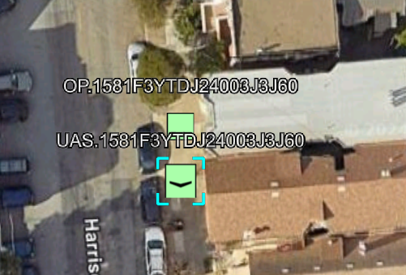
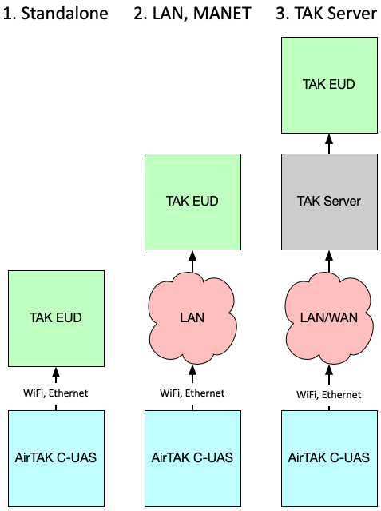
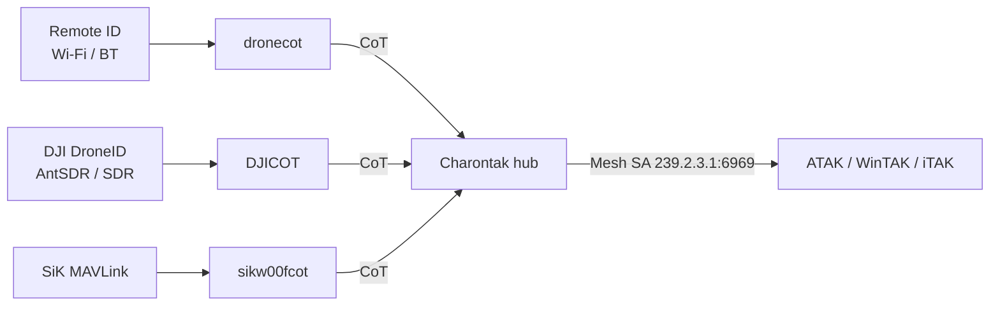

# Drones (Counter-UAS)

Detect and track drones for counter-UAS (C-UAS) awareness. Select the **`cuas`** role, attach a Remote ID receiver and/or a DJI DroneID SDR, and drones appear in ATAK/WinTAK/iTAK as native Cursor on Target (CoT) tracks — often complete with the operator's location.

{ width="640" }

AryaOS builds a C-UAS picture from two complementary detection sources:

- **Remote ID / Open Drone ID** — the FAA-mandated broadcast that compliant drones emit over Wi-Fi/Bluetooth. Decoded by **`dronecot`** (on-board Wi-Fi/BLE, or a dedicated receiver — see below).
- **DJI DroneID** — DJI's proprietary telemetry, received over the air with an SDR (for example an **AntSDR**) and decoded by **DJICOT**.

`sikw00fcot` additionally converts SiK-radio MAVLink drone telemetry to CoT when you have that link.

!!! info "Dedicated Remote ID receiver: DroneScout DS110"
    A **BlueMark DroneScout DS110 / DroneBeacon** — a standards-based Remote ID receiver — plugs in over USB-serial and emits detected Remote ID as **MAVLink** (`OPEN_DRONE_ID_MESSAGE_PACK` or `ADSB_VEHICLE`). It is an **ESP32-S3** device; AryaOS pins it to a stable `/dev/dronescout` symlink (its per-unit serial path is not portable) and ships a second, opt-in dronecot instance, **`dronecot-dronescout`**, that reads it and feeds the same Charontak hub. Enable it on a DS110 box with `sudo systemctl enable --now dronecot-dronescout` (requires `dronecot` ≥ 2.2.3). It runs alongside the AntSDR/DJI source for a multi-source Remote ID picture. *(Live-verified against a DroneBeacon DB120.)*

!!! info "Wi-Fi Remote ID: monitor-mode adapter"
    dronecot decodes Open Drone ID **directly off the air over Wi-Fi** (ASTM F3411 Beacon vendor IE *and* Wi-Fi Alliance NAN) using a **monitor-mode** USB adapter — an Atheros **AR9271 (`ath9k_htc`)** or Realtek **8821CU** works well. AryaOS ships an opt-in instance, **`dronecot-wifi`** (`FEED_URL=wifi://wlan1`, channel-hopping 1/6/11); enable it on a box with an external adapter: `sudo systemctl enable --now dronecot-wifi`. Use `wireless://wlan1` to run Wi-Fi + BLE together. *(Live-verified 2026-07-24: an AR9271 decoded a BlueMark DroneBeacon Wi-Fi squawk — the same aircraft the DS110 decoded over serial.)* `wlan0` is the on-board AP radio — always use the external adapter.

!!! tip "Plug & play by design"
    AirTAK C-UAS is designed to work out of the box: power the device, connect a TAK EUD (ATAK, WinTAK, iTAK) to its Wi-Fi hotspot, and drone tracks flow with no extra configuration. *When in doubt, reboot.*

## Turn on the C-UAS role

=== "Web console"

    1. Open **Cockpit → AryaOS Site** (`https://<host>/admin/` or `https://aryaos.local`).
    2. In the **Device role** card, choose **C-UAS — drone detection**.
    3. Click **Apply role**.

    AryaOS enables `dronecot` and `sikw00fcot`, and stops the air and maritime pipelines.

=== "Command line"

    ```bash
    sudo aryaos-role set cuas
    ```

## Three CONOP modes

An AirTAK C-UAS can run in one of three connectivity modes:

{ width="640" }

1. **Standalone.** One or more EUDs connect directly to the AirTAK Wi-Fi hotspot or Ethernet. This is the default, off-the-shelf configuration and needs **no** extra setup.
2. **LAN / MANET.** AirTAK's Wi-Fi or Ethernet connects to an existing LAN or MANET, extending coverage across the team.
3. **TAK Server.** AirTAK connects to a network and forwards CoT to a [TAK Server](./connect-tak-server.md).

### Standalone using Wi-Fi

1. Connect USB power. On kitted units, match the color-coded connectors (yellow to yellow, black to black).
2. After about two minutes, a Wi-Fi network named `AryaOS-XXXX` appears. Join it.
3. Open ATAK, WinTAK, or iTAK — drone tracks arrive over Mesh SA automatically.

### Joining an existing network

To put AirTAK on your own Wi-Fi (which disables its hotspot), or to use Ethernet, follow the onboarding steps in [Offline backpack](./offline-backpack.md#onboarding-wi-fi) and the [Networking](../networking/wifi-hotspot.md) pages, then reach the console at `https://aryaos.local` or the device's DHCP address.

## How it flows


```mermaid
flowchart LR
    RID[Remote ID<br/>Wi-Fi / BT] --> DC[dronecot]
    DJI[DJI DroneID<br/>AntSDR / SDR] --> DJICOT[DJICOT]
    MAV[SiK MAVLink] --> SK[sikw00fcot]
    DC & DJICOT & SK -->|CoT| H[Charontak hub]
    H -->|Mesh SA 239.2.3.1:6969| E[ATAK / WinTAK / iTAK]
```

Each detector emits CoT to the Charontak hub at `udp+wo://127.0.0.1:28087`; Charontak forwards to Mesh SA and any [TAK Server lanes](./connect-tak-server.md).

## Manage the AntSDR

An **AntSDR E200** running the [alphafox02 DJI DroneID firmware](https://github.com/alphafox02/antsdr_dji_droneid) detects DJI OcuSync DroneID and **pushes it to `dronecot` over point-to-point Ethernet** (TCP `172.31.100.1:52002`). That Ethernet link is the data path; the AntSDR's **USB-serial is its Zynq config/recovery console, not a data feed**.

- **Health at a glance.** AryaOS polls the feed every 30 s (`aryaos-antsdr-health`) and, when an AntSDR is present, shows an **AntSDR (DJI DroneID)** card in Cockpit: green when the feed socket is established, amber when the SDR is reachable but silent (normal with no DJI drone in range; otherwise the firmware may have stalled). The card is hidden on boxes with no AntSDR. Check it by hand any time:

    ```bash
    aryaos-antsdr-health --json
    ```

- **Console access.** To configure the SDR (e.g. `fw_setenv` to change its IP) or recover a wedged unit without a second computer, open its console from the Pi:

    ```bash
    aryaos-antsdr-console          # login: root / analog — quit tio with Ctrl-t q
    ```

    On an AntSDR box, pin a stable `/dev/antsdr-console` first with `sudo touch /etc/aryaos/antsdr-console.enabled && sudo udevadm trigger` (the console adapter is a generic CH340, so this symlink is opt-in to avoid clashing with a CH340-based GPS).

## Verify tracks

1. Connect an EUD to the `AryaOS-XXXX` hotspot and open your TAK client.
2. On the box:

    ```bash
    systemctl status dronecot sikw00fcot
    ```

3. Fly a Remote ID-compliant drone (or a known DJI aircraft) nearby and confirm the track — including, where broadcast, the operator/pilot position.

!!! note "What you'll see"
    Remote ID broadcasts typically include the drone's position, altitude, and the operator's ground location, letting you map both the aircraft and its pilot. DJI DroneID similarly carries home/operator coordinates.

## Connecting an EUD

AirTAK C-UAS is tested with all TAK products (iTAK, WinTAK, ATAK). Out of the box, local feeders send to Charontak on the gateway, which multicasts CoT to the Mesh SA group `239.2.3.1:6969`. Upstream TAK Server destinations are added as Charontak lanes — see [Connect a TAK Server](./connect-tak-server.md).

## Related

- [Multi-sensor](./multi-sensor.md) — combine drone detection with air and maritime.
- [Connect a TAK Server](./connect-tak-server.md) · [Offline backpack](./offline-backpack.md)
- [Device roles](../config/device-roles.md) · [Glossary](../reference/glossary.md)
