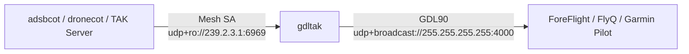

# Display the air picture in ForeFlight

See the TAK air picture in your Electronic Flight Bag (EFB). AryaOS runs **GDLTAK**, which rebroadcasts Cursor on Target (CoT) tracks as **GDL90** over UDP, so **ForeFlight**, **FlyQ EFB**, and **Garmin Pilot** display the same traffic TAK sees.

GDLTAK is the reverse of `adsbcot`: **CoT in, GDL90 out**. It subscribes to the CoT air picture, keeps a table of tracks, and once a second emits GDL90 Heartbeat, Ownship, and Traffic Report datagrams — exactly as a stratux or GDL 90 receiver would. Any traffic on your TAK network shows up in the cockpit: ADS-B via `adsbcot`, drone Remote ID via `dronecot`, even tracks from a TAK Server.

!!! info "Enabled by the air and multi roles"
    `gdltak` is part of the `air` and `multi` role unit sets, so selecting either role in **Cockpit → AryaOS Site** turns it on automatically. See [Air — ADS-B & UAT](./air-adsb.md) and [Device roles](../config/device-roles.md).

## ForeFlight setup

=== "ForeFlight"

    1. Put the iPad/iPhone on the **same Wi-Fi network** as the AryaOS box — join the `AryaOS-xxxx` hotspot.
    2. That's it. ForeFlight auto-detects GDL90 traffic on **UDP port 4000** and lists the source under **More → Devices**.

=== "FlyQ EFB / Garmin Pilot"

    Same behavior: join the same Wi-Fi, and the app auto-detects GDL90 traffic on UDP 4000. No manual IP entry needed.

!!! warning "Same Wi-Fi is required"
    GDLTAK broadcasts GDL90 to `255.255.255.255:4000` by default. Broadcast does not cross subnets, so the EFB device must be on the **same Wi-Fi network / L2 segment** as the box (e.g. both on the AryaOS hotspot). It is not carried over a routed uplink.

## How it flows



## Configuration

GDLTAK is PyTAK-style, configured via `/etc/default/gdltak` (systemd `EnvironmentFile`), inheriting site defaults first:

| Key | Default | Description |
|-----|---------|-------------|
| `COT_URL` | `udp+ro://239.2.3.1:6969` | CoT source. Default is the Mesh SA multicast group. |
| `GDL90_URL` | `udp+broadcast://255.255.255.255:4000` | GDL90 egress. Broadcast is the stratux/ForeFlight convention; unicast `udp://host:port` also works. |
| `STALE_SECS` | `60` | Drop tracks not updated within this many seconds. |
| `UPDATE_HZ` | `1` | GDL90 update rate (heartbeat convention is 1 Hz). |
| `OWNSHIP_UID` | — | CoT UID whose track becomes the Ownship Report (e.g. this device's GPSTAK/LINCOT UID). |
| `OWNSHIP_LAT` / `OWNSHIP_LON` / `OWNSHIP_ALT_FT` | — | Static ownship position fallback. |
| `CALLSIGN` | `GDLTAK` | Ownship callsign shown in the EFB. |

### Ownship

Give the EFB a blue "you are here" ownship in one of two ways:

- **Live:** set `OWNSHIP_UID` to this box's GPSTAK/LINCOT CoT UID so the device's own GPS becomes ownship. See [Own position / GPS](./own-position-gps.md).
- **Static:** set `OWNSHIP_LAT` / `OWNSHIP_LON` / `OWNSHIP_ALT_FT` for a fixed location.

If no ownship is configured, GDLTAK sends heartbeat + traffic only.

!!! note "Advisory traffic, not certified ADS-B In"
    CoT carries geometric (HAE) altitude, which GDLTAK uses for the Traffic Report altitude and the Ownship Geometric Altitude message. EFBs treat this as **advisory traffic**, not certified ADS-B In. Tracks with `ICAO-A1B2C3`-style UIDs keep their real 24-bit ICAO address; other tracks get a stable self-assigned address hashed from the UID.

## Verify

```bash
systemctl status gdltak
```

Then open ForeFlight and confirm traffic appears under **More → Devices** and on the map. If nothing shows, confirm the EFB device is on the AryaOS hotspot (same subnet) and that traffic exists on the TAK side.

## Related

- [Air — ADS-B & UAT](./air-adsb.md) — feed the aircraft that GDLTAK rebroadcasts.
- [Own position / GPS](./own-position-gps.md) — supply GDLTAK's ownship.
- [Multi-sensor](./multi-sensor.md) · [Device roles](../config/device-roles.md) · [Glossary](../reference/glossary.md)
