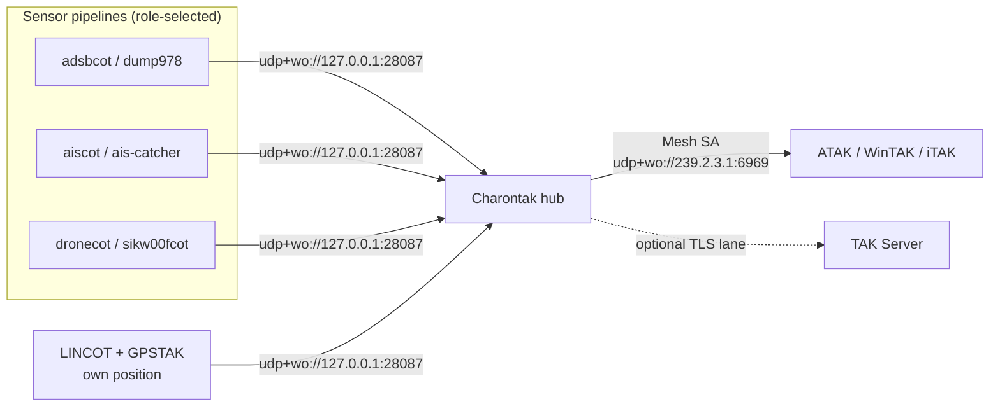

# Choose a deployment

One AryaOS image runs every mission. You pick a **device role** in the web console, and AryaOS turns on exactly the sensor pipelines that role needs — no reflashing, no reconfiguring.

## The mission-based model

AryaOS is an all-in-one situational-awareness gateway: it decodes sensors at the edge and delivers a single Common Operating Picture (COP) to any TAK client (ATAK, WinTAK, iTAK) over Cursor on Target (CoT). Rather than shipping a different image per mission, every AryaOS device runs the **same** software and you select what it does at runtime.

The core CoT plumbing — the Charontak hub, LINCOT host beacon, GPSTAK network GPS, and `gpsd` — always runs. The **role** you choose toggles which *sensor* pipelines run on top of it. Change your mind in the field and switch roles in seconds.

!!! info "Where the role lives"
    The role is stored as `ARYAOS_ROLE` in the site config (`/etc/aryaos/aryaos-config.txt`) and applied by the `aryaos-role` helper. You set it from the **Device role** card in **Cockpit → AryaOS Site**. See [Device roles](../config/device-roles.md) for the full reference.

## Pick your scenario

-   :material-airplane: **Aircraft (ADS-B / UAT)**

    Track crewed aircraft on 1090 MHz and 978 MHz with an SDR and antenna.

    [Air — ADS-B & UAT](./air-adsb.md)

-   :material-ferry: **Vessels (AIS)**

    Put ships and boats on the map from marine AIS, over the air or from an online feed.

    [Maritime — AIS](./maritime-ais.md)

-   :material-quadcopter: **Drones (Counter-UAS)**

    Detect and track drones via Remote ID and DJI DroneID for C-UAS awareness.

    [Counter-UAS](./counter-uas.md)

-   :material-crosshairs-gps: **Own position**

    Beacon the box's own GPS position to TAK and feed network GPS to your EUD.

    [Own position / GPS](./own-position-gps.md)

-   :material-layers-triple: **Everything at once**

    Fuse air, maritime, and drone tracks into one COP on a single device.

    [Multi-sensor](./multi-sensor.md)

-   :material-router-network: **CoT router only**

    Run a box purely as a Charontak relay between networks and TAK Servers.

    [Relay / routing](./relay-routing.md)

-   :material-server-network: **Forward to a TAK Server**

    Push the picture upstream via a data package or `tak://` enrollment URL.

    [Connect a TAK Server](./connect-tak-server.md)

-   :material-airplane-takeoff: **Display in ForeFlight**

    Show the TAK air picture in ForeFlight, FlyQ, or Garmin Pilot via GDL90.

    [ForeFlight / GDL90](./foreflight-gdl90.md)

-   :material-backpack: **Fully offline**

    Disconnected backpack ops with a Wi-Fi hotspot and Bluetooth PAN.

    [Offline backpack](./offline-backpack.md)

## Roles at a glance

Each role maps to a set of sensor units, which in turn dictate the hardware you attach.

| Role | Sensor pipelines enabled | Typical hardware |
|------|--------------------------|------------------|
| `multi` | ADS-B + UAT, AIS, and drone detection — all pipelines | 2× RTL-SDR (1090 + 978), AIS SDR, drone-detection SDR/receiver, GPS |
| `air` | ADS-B decoder (`readsb`/`dump1090-fa`), `dump978-fa`, `adsbcot`, `gdltak` | RTL-SDR + 1090 MHz antenna; optional 2nd SDR + 978 MHz antenna |
| `maritime` | `ais-catcher`, `aiscot` | RTL-SDR + marine VHF antenna (or an online AIS feed, no SDR) |
| `cuas` | `dronecot`, `sikw00fcot` | Remote ID receiver and/or DJI DroneID SDR (e.g. AntSDR) |
| `relay` | none — CoT routing only | No sensors; just network (Wi-Fi/Ethernet/MANET) |

!!! note "The core always runs"
    Regardless of role, `charontak`, `lincot`, `gpstak`, and `gpsd` stay running — so a `relay` box still beacons its own position and forwards CoT, and every role can share GPS with a connected EUD.

The `air` role also enables `gdltak`, which lets [ForeFlight and other EFB apps](./foreflight-gdl90.md) display the air picture over GDL90.

## How the picture flows

Local feeders publish CoT to the Charontak hub on `udp+wo://127.0.0.1:28087`. Charontak owns egress: by default it multicasts to the **Mesh SA** group `udp+wo://239.2.3.1:6969` (which your EUD picks up automatically), and it can add one or more [TAK Server lanes](./connect-tak-server.md).

## Next steps

- New to AryaOS? Start with the [Quickstart](../get-started/quickstart.md).
- Unsure what a term means? See the [Glossary](../reference/glossary.md).
- Ready to route upstream? [Connect a TAK Server](./connect-tak-server.md).
