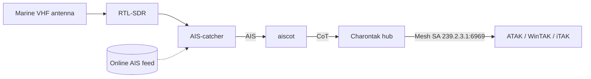

# Vessels via AIS

Put ships and boats on your Common Operating Picture (COP). Attach an SDR and a marine VHF antenna (or point AryaOS at an online feed), select the **`maritime`** role, and AIS traffic appears in ATAK/WinTAK/iTAK as native Cursor on Target (CoT) tracks.

Vessels broadcast **AIS (Automatic Identification System)** on two marine VHF channels near **161.975 / 162.025 MHz**. AryaOS receives AIS with **AIS-catcher**, then `aiscot` converts each vessel report to CoT.

## Two ways to receive AIS

=== "Over the air (SDR)"

    AIS-catcher decodes AIS directly from RF with an RTL-SDR and a marine VHF antenna — no internet required. This is the standalone, disconnected mode.

    | Part | Notes |
    |------|-------|
    | RTL-SDR (RTL2832U) | AIS-catcher's primary supported SDR. |
    | Marine VHF antenna | Tuned near 162 MHz. A proper marine whip vastly out-ranges a stock dongle antenna. |
    | Coax / mount | Height and a clear view of the water drive range. |

    !!! tip "VHF antenna matters"
        AIS is line-of-sight at VHF. Reception is dominated by antenna height and quality — an elevated marine VHF antenna is the single biggest range improvement. Keep the AIS antenna separated from 1090/978 MHz antennas on multi-sensor boxes to limit desense.

=== "Online feed"

    If the box has internet, AIS-catcher can pull from an online AIS source instead of (or in addition to) local RF — useful when you have no antenna or want wide-area coverage. No SDR is required in this mode. Configure the AIS-catcher input from the AIS-catcher plugin in Cockpit.

## Turn on the maritime role

=== "Web console"

    1. Open **Cockpit → AryaOS Site** (`https://<host>/admin/` or `https://aryaos.local`).
    2. In the **Device role** card, choose **Maritime — AIS vessels**.
    3. Click **Apply role**.

    AryaOS enables `ais-catcher` and `aiscot`, and stops the air and drone pipelines.

=== "Command line"

    ```bash
    sudo aryaos-role set maritime
    ```

## How it flows



AIS-catcher exposes a local web UI and JSON on **port 8100** (allowed through the firewall by default), and `aiscot` reads its output and emits CoT to the Charontak hub at `udp+wo://127.0.0.1:28087`.

## Verify tracks

1. Connect your EUD to the AryaOS hotspot (`AryaOS-xxxx`) or the same network; open your TAK client. Vessels appear automatically via Mesh SA.
2. On the box:

    ```bash
    systemctl status ais-catcher aiscot
    ```

3. Browse the AIS-catcher UI at `http://<host>:8100` to confirm messages are being decoded.

!!! note "MMSI and vessel types"
    `aiscot` maps AIS vessel data (MMSI, name, navigational status, and ship type) into TAK CoT types so vessels are distinguishable on the map. See [AISCOT](https://aiscot.readthedocs.io/) for the full mapping.

## Related

- [Multi-sensor](./multi-sensor.md) — run maritime alongside air and drone.
- [Air — ADS-B & UAT](./air-adsb.md) · [Counter-UAS](./counter-uas.md)
- [Connect a TAK Server](./connect-tak-server.md) — forward the maritime picture upstream.
- [Device roles](../config/device-roles.md) · [Glossary](../reference/glossary.md)
