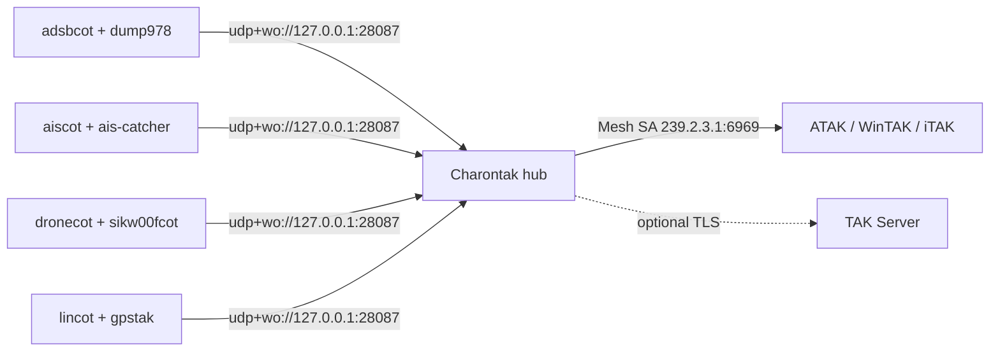

# Multi-sensor: one COP, every sensor

Run aircraft, vessels, and drones on a single box. Select the **`multi`** role and AryaOS fuses ADS-B/UAT, AIS, and drone detection into one Common Operating Picture (COP) delivered to ATAK/WinTAK/iTAK.

`multi` is the default role. It enables **all** sensor pipelines at once — nothing is turned off.

## What the multi role runs

| Domain | Units enabled | Deep dive |
|--------|---------------|-----------|
| Air (ADS-B 1090 + UAT 978) | ADS-B decoder (`readsb`/`dump1090-fa`), `dump978-fa`, `adsbcot`, `gdltak` | [Air — ADS-B & UAT](./air-adsb.md) |
| Maritime (AIS) | `ais-catcher`, `aiscot` | [Maritime — AIS](./maritime-ais.md) |
| Drones (C-UAS) | `dronecot`, `sikw00fcot` | [Counter-UAS](./counter-uas.md) |
| Position core (always on) | `charontak`, `lincot`, `gpstak`, `gpsd` | [Own position / GPS](./own-position-gps.md) |

## Turn on the multi role

=== "Web console"

    1. Open **Cockpit → AryaOS Site** (`https://<host>/admin/` or `https://aryaos.local`).
    2. In the **Device role** card, choose **Multi-sensor (all pipelines)**.
    3. Click **Apply role**.

=== "Command line"

    ```bash
    sudo aryaos-role set multi
    ```

## Fusing into one COP

Every feeder — air, maritime, drone, and position — publishes CoT to the **same** Charontak hub on `udp+wo://127.0.0.1:28087`. Charontak merges them and forwards a single stream to Mesh SA (and any [TAK Server lanes](./connect-tak-server.md)), so your EUD sees one unified picture.



## Hardware for a full multi build

To actually *see* all three domains at once you need the radios for each:

| Domain | Radio | Antenna | SDR serial |
|--------|-------|---------|------------|
| ADS-B 1090 | RTL-SDR | 1090 MHz | `stx:1090:0` |
| UAT 978 | RTL-SDR | 978 MHz | `stx:978:0` |
| AIS | RTL-SDR | Marine VHF (~162 MHz) | (AIS-catcher input) |
| DJI DroneID | SDR (e.g. AntSDR) | per receiver | — |
| Remote ID | Wi-Fi/BT receiver | built-in | — |

!!! danger "Give each SDR a unique EEPROM serial"
    With multiple RTL-SDR dongles attached, each must have a distinct serial or the decoders will contend for the wrong device. Re-serial from the **Radios** card or `aryaos-sdr set-serial`. See [Air — ADS-B & UAT](./air-adsb.md#sdr-serials-dual-sdr-setups).

## Resource notes

Running every pipeline is the heaviest configuration AryaOS supports.

- **Compute.** Multiple SDR decoders (`readsb`/`dump978-fa`/`ais-catcher`) plus DroneID demod are CPU-bound. A Raspberry Pi 4 or 5 is recommended for a full `multi` build; a Pi 3 can struggle with all radios active.
- **USB & power.** Several SDRs on one USB bus draw significant current — use a supply and cabling rated for the load, especially on battery in the field.
- **RF isolation.** Keep the 1090/978 MHz, marine VHF, and DroneID antennas spaced apart to reduce mutual desense; add band filters (e.g. a 1090 SAW filter) where interference is high.

!!! tip "Scale down when you don't need everything"
    If a mission only needs one domain, switch to the focused role (`air`, `maritime`, or `cuas`) to free CPU and USB bandwidth. Roles switch at runtime — no reflash.

## Related

- [Air](./air-adsb.md) · [Maritime](./maritime-ais.md) · [Counter-UAS](./counter-uas.md) · [Own position](./own-position-gps.md)
- [Connect a TAK Server](./connect-tak-server.md) · [ForeFlight / GDL90](./foreflight-gdl90.md)
- [Device roles](../config/device-roles.md) · [Glossary](../reference/glossary.md)
