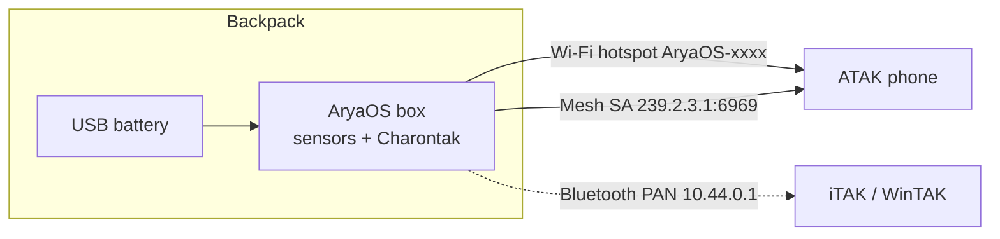
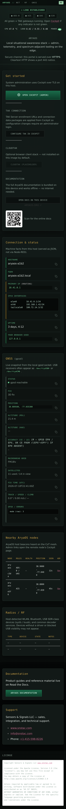

# Offline backpack ops

Run a full Common Operating Picture (COP) with **no internet at all**. AryaOS carries the sensors, the network, and the map in one box — power it from a battery, connect a phone over Wi-Fi or Bluetooth, and you have TAK situational awareness anywhere.

This is the original AirTAK concept of operations: a gateway in a backpack, an ATAK phone paired to it, and a portable USB battery — no LTE, no Wi-Fi infrastructure required.

{ width="640" }

!!! example "Proven in the field"
    In this configuration — a Samsung Galaxy S20 running ATAK paired to a backpack AirTAK on a USB battery, with **no** outside connectivity — a **55-mile** aircraft-detection range was achieved on a clear June day in San Diego. See the [Introduction](../get-started/overview.md).

## The disconnected CONOP

Everything happens on the box: sensors decode locally, Charontak multicasts the picture over Mesh SA, and your EUD joins over Wi-Fi or Bluetooth. Nothing leaves the backpack.

## Connect over the Wi-Fi hotspot

{ width="300" }

AryaOS runs a **comitup** onboarding hotspot on `wlan0`:

| Property | Value |
|----------|-------|
| SSID | `AryaOS-xxxx` (the 4-hex device suffix) |
| Security | **Open by default** — set WPA2 from the console (below) |
| Gateway IP | `10.41.0.1` |
| Console | `https://aryaos.local` or `https://10.41.0.1` |

1. Power the box (on kitted units, match the color-coded connectors: yellow to yellow, black to black).
2. Wait about two minutes for `AryaOS-xxxx` to appear, then join it.
3. Open ATAK/WinTAK/iTAK — Mesh SA tracks arrive automatically.

!!! danger "Lock the hotspot before you deploy"
    The onboarding hotspot is **open** out of the box. Set a WPA2 passphrase (8–63 characters) in the **Onboarding hotspot password** card in **Cockpit → AryaOS Site** before operating anywhere the SSID could be reached by others.

## Connect over Bluetooth PAN

When you'd rather not use Wi-Fi (to save the radio for sensors, or to avoid RF), pair a phone over Bluetooth. AryaOS acts as a Bluetooth Network Access Point (NAP):

| Property | Value | Source key |
|----------|-------|-----------|
| Bridge | `pan0` | `BT_PAN_BRIDGE` |
| Box IP | `10.44.0.1/24` | `BT_PAN_ADDRESS` / `BT_PAN_PREFIX` |
| DHCP pool for phones | `10.44.0.20`–`10.44.0.60`, 12h lease | `BT_PAN_DHCP_START` / `_END` / `_LEASE` |
| Enabled | yes (`BT_PAN_ENABLED=1`) | — |

AryaOS serves DHCP to the paired phone over the PAN link. There is **no NAT or forwarding** — Bluetooth PAN is only for reaching AryaOS services (the console, Mesh SA), not internet sharing. Once paired, browse to `https://10.44.0.1` and TAK reaches the box over Bluetooth. See [Bluetooth PAN](../bluetooth-pan.md) for pairing steps.

!!! warning "BLE advertising limitation"
    Bluetooth **PAN** (Classic) pairing works for phone-to-box networking. Note that BLE *advertising* is a separate function and is not the transport used here.

## Battery & power

- Any quality USB power bank runs the box; use one sized for your mission duration and the number of active SDRs.
- Multiple SDRs on the USB bus draw meaningful current — size the battery and cabling accordingly (see [Multi-sensor resource notes](./multi-sensor.md#resource-notes)).
- Keep the power connector fully seated; brownouts during radio ingest cause dropouts. *When in doubt, reboot.*

## Sharing position offline

Even fully disconnected, the box beacons its own GPS to the map and can feed a phone with no receiver of its own — see [Own position / GPS](./own-position-gps.md). This keeps every node visible on the local COP without any network backhaul.

## When connectivity returns

If you later reach a LAN, MANET, or TAK Server, you can onboard the box onto that network and forward the picture upstream without losing the local Mesh SA picture:

- Join an existing network via the onboarding portal or Ethernet — see [Counter-UAS CONOP modes](./counter-uas.md#three-conop-modes) and the [Networking](../networking/wifi-hotspot.md) pages.
- Forward to a server with [Connect a TAK Server](./connect-tak-server.md).

## Related

- [Bluetooth PAN](../bluetooth-pan.md) · [Networking](../networking/wifi-hotspot.md)
- [Own position / GPS](./own-position-gps.md) · [Multi-sensor](./multi-sensor.md)
- [Quickstart](../get-started/quickstart.md) · [Glossary](../reference/glossary.md)
