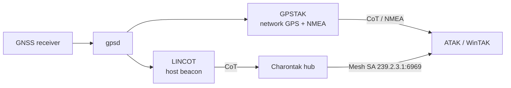

# Own position & GPS

Put the AryaOS box itself on the map, and share its GPS with your TAK client. This works in **every** role — the position core always runs — so your sensor gateway is also a self-locating node.

AryaOS uses two cooperating tools for position:

- **LINCOT** beacons the *host's own position* to TAK as a CoT marker, so the box shows up on the map like any other unit.
- **GPSTAK** streams `gpsd` position data to the network as CoT and fans out NMEA for WinTAK — giving a connected phone or laptop a GPS fix even when it has no receiver of its own.

Both feed from **`gpsd`**, which reads a connected GNSS receiver.

!!! note "Always on"
    `charontak`, `lincot`, `gpstak`, and `gpsd` are part of the CoT core and run regardless of the selected [device role](../config/device-roles.md) — including `relay`. You do not need a special role to share position.

## Hardware

| Part | Notes |
|------|-------|
| USB or UART GNSS receiver | Any `gpsd`-supported GPS/GNSS puck. Give it a clear view of the sky. |
| (Optional) none | If you have no receiver, use a static fallback position (below). |

## How position flows



- **LINCOT → Charontak → Mesh SA:** the box appears as a self-marker on every connected EUD.
- **GPSTAK → EUD:** a phone or WinTAK laptop on the AryaOS network uses the box's GPS as its own position source.

## Share the box's position with TAK

No configuration is required in the common case: connect a GNSS receiver, connect your EUD to the AryaOS hotspot, and the box's marker appears via Mesh SA.

To confirm the pipeline:

```bash
systemctl status gpsd lincot gpstak
gpspipe -w -n 5        # raw gpsd JSON — check for TPV with lat/lon
```

!!! tip "Identity on the map"
    The box's marker uses `COT_HOST_ID` (set on first boot to `aryaos-<suffix>`) as its source identity. Override `COT_HOST_ID` in the site config to give a unit a mission-specific callsign.

## Give your EUD a network GPS fix

When your phone or WinTAK machine has no GPS (or a poor one indoors/in a vehicle), point it at GPSTAK:

=== "WinTAK"

    GPSTAK fans out NMEA that WinTAK can consume as an external GPS source, so a laptop with no receiver gets a live fix from the box.

=== "ATAK"

    ATAK can take its position from the network via CoT/GPSTAK when running on a device without its own reliable fix.

See the [GPSTAK](https://github.com/snstac/gpstak) project for client-side setup details. GPS integrity (spoof/jam) can be monitored from the **cockpit-gps** plugin.

## Static position fallback

If the box has no GNSS receiver — or you want a fixed marker for a base station or repeater — set a static position instead of relying on `gpsd`. LINCOT supports a fixed lat/lon so the host still beacons a location. Configure it from the LINCOT plugin in Cockpit (which edits `/etc/default/lincot`).

!!! info "Wildland fire & SAR"
    In fire and search-and-rescue deployments, a self-locating gateway lets the incident COP show exactly where each sensor node sits, even when the carrying EUD is offline.

## Related

- [Offline backpack](./offline-backpack.md) — position sharing over a disconnected hotspot.
- [ForeFlight / GDL90](./foreflight-gdl90.md) — use this device's position as GDL90 ownship.
- [Device roles](../config/device-roles.md) · [Glossary](../reference/glossary.md)
