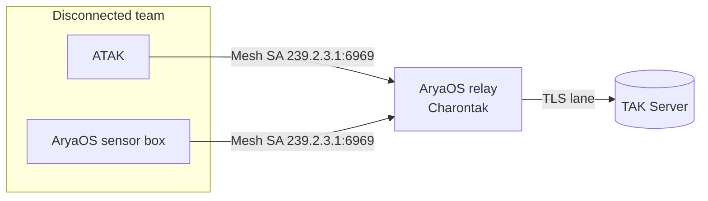

# Relay & CoT routing

Run an AryaOS box purely as a Cursor on Target (CoT) router. Select the **`relay`** role and the device stops all sensors, dedicating itself to moving CoT between networks and TAK Servers through the **Charontak** hub.

Use a relay when you need to *carry the picture*, not *make* it: bridge a Mesh SA group to a TAK Server, join two networks, or place a forwarding node at the edge of a MANET.

## What Charontak is

**Charontak** is the CoT bridge/router at the heart of every AryaOS box (named for the ferryman — it *ferries* CoT). Every local feeder sends to Charontak, and Charontak owns all egress:

- It **listens** for CoT on `udp+ro://127.0.0.1:28087` (the site-config `COT_URL` default that feeders target with `udp+wo://127.0.0.1:28087`).
- It **forwards** to one or more **lanes**. The default lane multicasts to **Mesh SA** at `udp+wo://239.2.3.1:6969`; optional lanes reach a [TAK Server](./connect-tak-server.md) over TLS.

On AryaOS, Charontak is configured at `/etc/charontak.ini` and edited from **Cockpit → Charontak** at `https://<host>/admin/`. See [Charontak lanes](../admin/charontak-lanes.md) for the full editor reference.

## Lanes: ingress → egress

A **lane** is a one-directional route with an `ingress_cot_url` (where CoT comes in) and an `egress_cot_url` (where it goes out), plus `mode = forward`. Enable or disable each independently.

```ini title="/etc/charontak.ini (AryaOS default)"
[charontak]
DEBUG = false

[lane:local-to-mesh]
enabled = true
mode = forward
ingress_cot_url = udp+ro://127.0.0.1:28087
egress_cot_url = udp+wo://239.2.3.1:6969
PYTAK_NO_HELLO = true

[lane:local-to-takserver]
enabled = false
mode = forward
ingress_cot_url = udp+ro://127.0.0.1:28087
egress_cot_url = tls://takserver.example.com:8089
PYTAK_NO_HELLO = true
```

For a pure relay you typically change the **ingress** to a network source rather than loopback. Common patterns:

=== "Mesh → TAK Server"

    Bridge a local ATAK Mesh SA group up to a TAK Server.

    ```ini
    [lane:mesh-to-takserver]
    enabled = true
    mode = forward
    ingress_cot_url = udp+ro://239.2.3.1:6969
    egress_cot_url = tls://takserver.example.com:8089
    PYTAK_NO_HELLO = true
    ```

=== "Feeder network → mesh"

    Accept UDP CoT from feeders elsewhere on the network and republish to mesh.

    ```ini
    [lane:local-to-mesh]
    enabled = true
    mode = forward
    ingress_cot_url = udp://:18087          # udp://:PORT ≡ udp+ro://0.0.0.0:PORT
    egress_cot_url = udp+wo://239.2.3.1:6969
    PYTAK_NO_HELLO = true
    ```

=== "Mesh → TAK enrollment"

    Egress to a TAK Server via a `tak://` enrollment URL (needs `pytak[with-aiohttp,with-crypto]`).

    ```ini
    [lane:mesh-to-tak]
    enabled = true
    mode = forward
    ingress_cot_url = udp+ro://239.2.3.1:6969
    egress_cot_url = tak://com.atakmap.app/enroll?host=takserver.example.com&username=USER&token=TOKEN
    PYTAK_NO_HELLO = true
    ```

!!! warning "PyTAK 7.x has no TCP listen"
    PyTAK 7.x does **not** support `tcp+ppt://` (TCP listen). Use `tcp://host:port` only as an *outbound* client to a service that is already listening. To ingest from many clients, use UDP or a TAK Server.

## Turn on the relay role

=== "Web console"

    1. Open **Cockpit → AryaOS Site** (`https://<host>/admin/`).
    2. In the **Device role** card, choose **Relay — CoT routing only**.
    3. Click **Apply role**.

    All sensor units are stopped; Charontak (and the position core) keep running.

=== "Command line"

    ```bash
    sudo aryaos-role set relay
    ```

!!! note "A relay still beacons itself"
    The `relay` role only disables *sensors*. `charontak`, `lincot`, `gpstak`, and `gpsd` stay running, so the relay node still routes CoT **and** reports its own position to the map. See [Own position / GPS](./own-position-gps.md).

## When to use a relay

- **Uplink node.** A box with backhaul (Ethernet/LTE/satellite) bridges a disconnected team's Mesh SA to a distant TAK Server.
- **Network bridge.** Join two segments — for example a MANET and a command LAN — passing CoT between them.
- **Fan-out / consolidation.** Collect CoT from several feeders and forward one consolidated stream upstream.



## Related

- [Charontak lanes](../admin/charontak-lanes.md) — full lane editor reference.
- [Connect a TAK Server](./connect-tak-server.md) — provision the TLS/enrollment egress lane.
- [Offline backpack](./offline-backpack.md) · [Device roles](../config/device-roles.md) · [Glossary](../reference/glossary.md)
