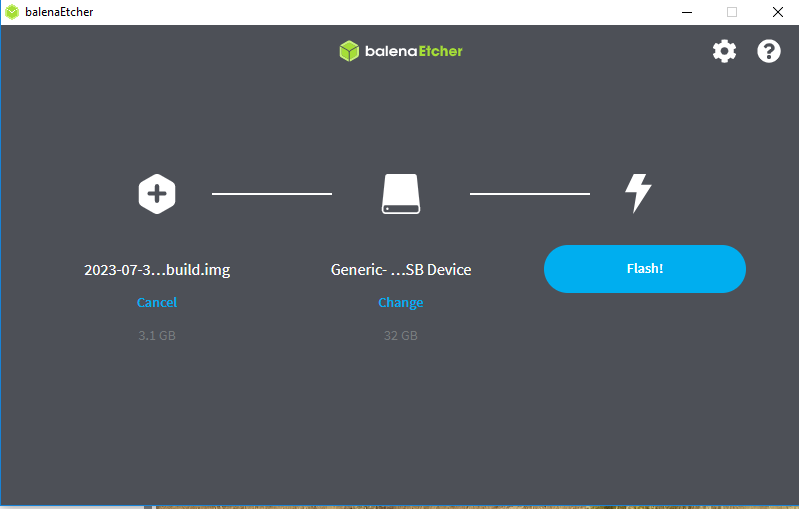

# Flash the image

Write the AryaOS image to a microSD card, then boot your Raspberry Pi from it. The quickest route is **AryaOS Imager**, which downloads the image for you; Raspberry Pi Imager and balenaEtcher also work if you already have them.

!!! danger "Flashing erases the card"
    Writing an image overwrites everything on the target microSD card. Double-check the drive you select before you start.

## Before you begin

- A supported Raspberry Pi and a microSD card of at least **16 GB** (32 GB recommended) — see [Hardware & requirements](hardware.md).
- A workstation running Windows, macOS, or Linux.
- The AryaOS image file (next section).

## Get the image

**If you use AryaOS Imager you can skip this section** — it fetches the current image itself.

| Source | Where | When to use |
|---|---|---|
| AryaOS Imager | [github.com/snstac/aryaos-imager](https://github.com/snstac/aryaos-imager/releases) | Easiest: picks up the latest image automatically |
| GitHub Releases | [github.com/snstac/aryaos/releases](https://github.com/snstac/aryaos/releases) | Downloading the `.img.xz` by hand |
| CI artifacts | GitHub Actions build artifacts on the repo | Testing an unreleased build your team pointed you to |

Downloaded by hand, the image is a compressed `.img.xz`. Every tool below reads `.img.xz` directly — you do not need to decompress it first.

!!! info "Every release is signed and bill-of-materials'd"
    Each image build attaches an SPDX and CycloneDX software bill of materials (SBOM) to its GitHub Release, and all AryaOS packages install from the [signed apt repository](https://snstac.github.io/packages). See [SBOM & supply chain](../operations/sbom.md).

## Flash the card

=== "AryaOS Imager"

    [AryaOS Imager](https://github.com/snstac/aryaos-imager/releases) is a single-purpose build of Raspberry Pi Imager that offers **only AryaOS**. It downloads the image for you, so there is no file to find and no way to pick the wrong operating system.

    | Platform | Download |
    |---|---|
    | Windows | `AryaOS-Imager-Setup-*.exe` (installer) or `aryaos-imager.exe` (portable) |
    | Linux | `aryaos-imager` — an x86-64 binary |
    | macOS | **not built yet** — use Raspberry Pi Imager or balenaEtcher |

    1. Download and install AryaOS Imager.
    2. Insert the microSD card into your workstation.
    3. Open AryaOS Imager and choose **AryaOS (latest release)**. A **latest dev** build is also offered — that one bakes in lab access and is not for field use.
    4. Under storage, select the microSD card. **Confirm the device — this erases the card.**
    5. Write, and wait for the verify step to finish.

    !!! warning "Windows shows a SmartScreen warning, and you cannot yet checksum the fix"
        The installer is not code-signed, so Windows displays *"Windows protected your PC"*. Click **More info → Run anyway**.

        Releases publish a `SHA256SUMS.txt`, but as of `v1.0.0` it covers **only the Linux binary** — the Windows installer, the portable `.exe` and the callback relay have no published checksum. So on Windows there is currently no way to verify the download, and the "run anyway" step is a genuine trust decision. Prefer the Linux build where you have the choice, and re-check `SHA256SUMS.txt` on newer releases.

    The image itself is a separate matter and *is* verifiable: every AryaOS release publishes an SBOM and an uncompressed-image SHA, and the imager verifies what it wrote after writing it.

    There is no OS-customization step to skip: AryaOS configures itself on [first boot](first-boot.md), so the imager deliberately leaves those settings alone.

=== "Raspberry Pi Imager"

    [Raspberry Pi Imager](https://www.raspberrypi.com/software/) is the recommended tool. It runs on Windows, macOS, and Linux.

    1. Install Raspberry Pi Imager if you do not already have it.
    2. Insert the microSD card into your workstation.
    3. Open Raspberry Pi Imager.
    4. Under **Choose OS**, scroll to the bottom and select **Use custom**, then pick the downloaded AryaOS `.img.xz`.
    5. Under **Choose Storage**, select the microSD card. **Confirm the device — this erases the card.**
    6. Click **Next**, confirm, and wait for the write and verify steps to finish.

    !!! warning "Skip the OS customization prompt"
        If Imager offers to apply hostname, Wi-Fi, or user settings, choose **No** / skip it. AryaOS personalizes its own hostname and hotspot on [first boot](first-boot.md); pre-seeding those settings can conflict.

=== "balenaEtcher"

    [balenaEtcher](https://etcher.balena.io/) also writes AryaOS cards on Windows, macOS, and Linux.

    1. Download and install [balenaEtcher](https://etcher.balena.io/).
    2. Insert the target microSD card.
    3. Open balenaEtcher.
    4. Select **Flash from file** and choose the AryaOS image.
    5. Select the target microSD card.
    6. Click **Flash**.

    { width="720" }

    When the write finishes, balenaEtcher verifies the image automatically and then ejects the card.

## Boot the Pi

1. Eject the microSD card from your workstation.
2. Insert it into the powered-off Raspberry Pi.
3. Attach any radios, antennas, and GPS you plan to use (see [Hardware & requirements](hardware.md)).
4. Apply power.

Within a few seconds the AryaOS device flashes its green and red LEDs as it starts up.

!!! note "First boot takes about 120 seconds"
    A brand-new AryaOS device spends roughly two minutes on its first boot resizing the filesystem, choosing a unique identity, and generating its own web certificate. This only happens once. See [First boot & first login](first-boot.md) for exactly what happens and how to connect.

## Next step

- :material-power: **First boot & first login** — Connect to the hotspot, log in, and secure the device. [First boot & first login](first-boot.md)

