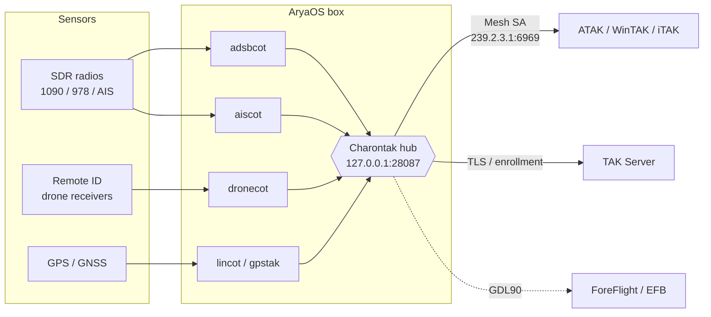

# What is AryaOS?

AryaOS is a Linux operating system that turns a small, inexpensive computer into
a **situational-awareness gateway** for [TAK](../reference/glossary.md#tak). It
ingests data from radios and sensors, converts it to
[Cursor on Target (CoT)](../reference/glossary.md#cot) — the native language of
ATAK, WinTAK, iTAK, and TAK Server — and delivers it to the operators who need
it, whether they are standing next to the box or across a wide-area network.

Everything is pre-installed and pre-wired. You flash a card, power it on, and
manage the whole system from a browser.

## What it does

Any phone or computer running ATAK, WinTAK, or iTAK, paired to an AryaOS gateway,
sees live tracks in native TAK formats:

- **Aircraft** from [ADS-B](../reference/glossary.md#ads-b) (1090 MHz) and UAT
  (978 MHz).
- **Vessels** from [AIS](../reference/glossary.md#ais), over the air or from an
  online aggregator.
- **Drones** from [Remote ID](../reference/glossary.md#remote-id) and DJI DroneID.
- **Own position** from an onboard GPS, shared to the whole team.

A single AryaOS box can run one of these missions or all of them at once, and can
relay the combined picture to a TAK Server for the wider force.

!!! example "Proven in the field"
    In its original **AirTAK** configuration — an AryaOS box and an ADS-B antenna
    in a backpack, powered by a USB battery, paired to a phone over Wi-Fi with no
    internet — operators have tracked aircraft at ranges past 50 miles. AryaOS is
    in daily use for wildland fire, security, and search-and-rescue.

## How it works

Sensors feed local **CoT gateways**, which all publish to a single on-box hub
called [Charontak](../reference/glossary.md#charontak). Charontak is the
switchboard: it fans the combined picture out to the local Wi-Fi mesh
([Mesh SA](../reference/glossary.md#mesh-sa)) and, optionally, upstream to a TAK
Server. This hub-and-spoke design means you point your feeds at one place and
change *where the data goes* in one place.

Each gateway is a small [PyTAK](../reference/glossary.md#pytak) program. Because
they all share one framework, they behave consistently: the same TLS settings,
the same URL schemes, the same site-wide configuration file. See the full
[software suite](../reference/software-suite.md).

## Managed from the browser

AryaOS is designed so an operator **never needs to SSH in**. A hardened
[Cockpit](https://cockpit-project.org/) web console on port 9090 (reachable over
HTTPS) exposes:

- **The AryaOS Site page** — TAK destination, TLS certificates, TAK Server
  enrollment, device role, radios, updates, VPN, hotspot password, support
  bundles, and Node-RED admin password. See [AryaOS Site](../admin/aryaos-site.md).
- **The Charontak lane editor** — a structured editor for where CoT flows.
- **Per-gateway pages** — one for each sensor (adsbcot, aiscot, dronecot, …).

SSH is still available for advanced work, but it is never required for normal
operation.

## Device roles

Rather than shipping a different image per mission, one AryaOS image adapts at
runtime. Pick a **[device role](../config/device-roles.md)** in the web console —
Air, Maritime, Counter-UAS, Multi-sensor, or Relay — and AryaOS enables the right
sensor pipelines and disables the rest. The CoT routing core always runs.

## What's in the box

| Layer | What AryaOS provides |
|-------|----------------------|
| **OS** | Debian-based, hardened, arm64 image for Raspberry Pi 3/4/5 |
| **Sensors** | ADS-B/UAT decoders (readsb, dump978-fa), AIS (AIS-catcher), drone Remote ID, GPS (gpsd) |
| **Gateways** | adsbcot, aiscot, dronecot, lincot, gpstak, gdltak, charontak, and more |
| **Admin** | Cockpit web console with the AryaOS Site page and per-gateway plugins |
| **Networking** | Onboarding Wi-Fi hotspot, Bluetooth PAN, Tailscale VPN, firewalld |
| **Ops** | One-click updates, redacted support bundles, SBOMs, neighbor discovery |

## Next steps

-   :material-rocket-launch: **[Quickstart](quickstart.md)** — from flash to first track.
-   :material-chip: **[Hardware & requirements](hardware.md)** — what to buy.
-   :material-map-marker-path: **[Choose a deployment](../deploy/index.md)** — mission-by-mission guides.
-   :material-book-open-variant: **[Glossary](../reference/glossary.md)** — TAK, CoT, ADS-B, and friends.

