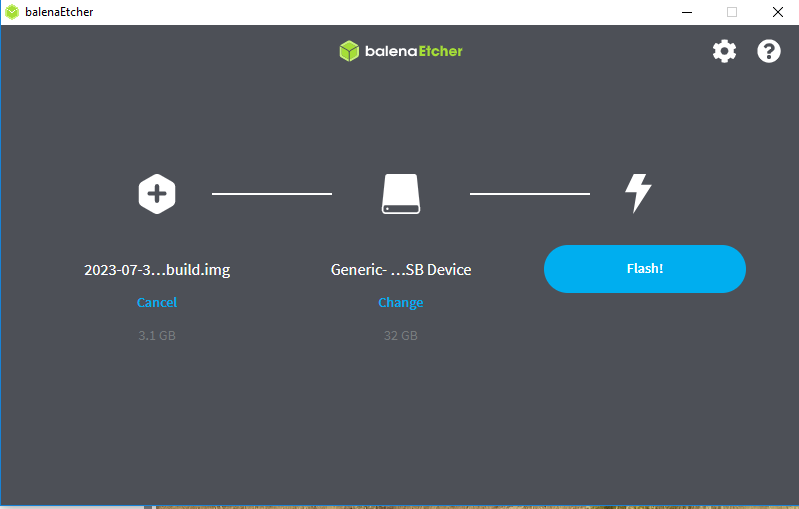

# Installing AryaOS

AryaOS should run on any ARM64-based computer, and is tested on the Raspberry Pi 3 & 4 models. To run AryaOS on a Raspberry Pi, download an SD card image and write it to a card. Any SD card larger than 16 GB should suffice to get started; 32 GB is recommended.

Image sources are described in [Download or build](build.md#download-aryaos).

## Raspberry Pi Imager

[Raspberry Pi Imager](https://www.raspberrypi.com/software/) is the preferred utility for creating an AryaOS SD card and runs on Windows, macOS, or Linux.

On your workstation:

1. Download an AryaOS `.img.xz` from [GitHub Releases](https://github.com/snstac/aryaos/releases) (or a CI artifact / other distribution channel your team uses).
2. Install Raspberry Pi Imager if you do not already have it.
3. Insert the microSD card you plan to use with the Raspberry Pi.
4. Open Raspberry Pi Imager.
5. Choose **Choose OS** → scroll to **Use custom** (bottom of the list) and select the downloaded AryaOS image file.
6. Choose **Choose Storage** and pick the microSD card (double-check the drive letter / device — **this erases the card**).
7. Click **Next**, then **Yes** to confirm, and wait for the verify step to finish.

*(Optional screenshot: use Raspberry Pi Imager’s built-in help or your own capture for local docs.)*

## balenaEtcher

[balenaEtcher](https://etcher.balena.io/) can be used to write an AryaOS microSD card on Windows, macOS, or Linux.

On the workstation:

1. Download and install [balenaEtcher](https://etcher.balena.io/).
2. Download the AryaOS microSD card image (`.img` or `.img.xz` as provided).
3. Insert the target microSD card.
4. Open balenaEtcher.
5. Select **Flash from file** and choose the AryaOS image.
6. Select the target microSD card.
7. Click **Flash**.

{ width="720" }

Once balenaEtcher has written the AryaOS microSD card image to the target microSD card, it will verify the image and eject the microSD card from the workstation.

On the target device:

1. Insert the target microSD card into the target device.
2. Power on (or connect power to) the target device.

## Next Steps

Within a few seconds of power-up, an AryaOS device will flash green and red lights.

1. Initial startup of a new AryaOS device (either pre-assembled or self-assembled) will take about 120 seconds. During this time the AryaOS device will resize its file system, set a unique hostname (`aryaos-xxxx`), and record [DEVICE_SUFFIX](definitions.md#device_suffix) in **`/etc/aryaos/aryaos-config.txt`**.
2. After initial startup, all AryaOS devices should boot within about 90 seconds.

Once an AryaOS device boots, it will establish a WiFi hotspot with an SSID resembling *AryaOS-XXXX*, where *XXXX* is the same four-character suffix as the hostname (from `/etc/machine-id`, or the primary NIC MAC if machine-id is unavailable).

If you have self-assembled an AryaOS device, you will need to manually set the SDR serial numbers for each SDR installed on the device. See the [Configuration](config.md) page.
