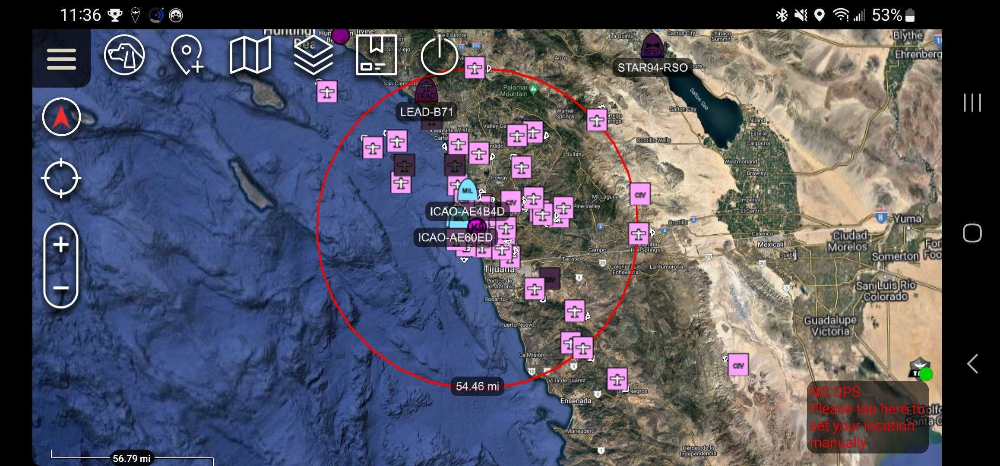

# Introduction

## What does AryaOS Do?

Any smartphone or computer running ATAK, WinTAK or iTAK, when paired to an AirTAK gateway, 
displays aircraft data in native TAK formats.

For example, in this field configuration, a Samsung Galaxy S20 smartphone running ATAK was paired to an AirTAK device carried in a backpack. The AirTAK was powered by a portable USB battery also in the backpack. No outside internet connectivity (no LTE, no WiFi) was utilized by the smartphone or AirTAK gateway

On a sunny & warm June day in downtown San Diego, a range of 55 miles was achived using this 
configuration.

## How does AirTAK work?

AirTAK creates a standalone ADS-B to TAK Gateway using WiFi. When paired with an ATAK, 
WinTAK or iTAK end-user device, AirTAK displays real-time aircraft data in native TAK 
formats. This allows TAK users to gain airspace situational awareness in an easily 
portable, turn-key device. When connected to a local or wide area network, AirTAK extends the operational coverage area and incrases airspace situational awareness.

## Where is AirTAK used?

AirTAK is in active use by wildland fire, security, safety & response organizations world-wide.
