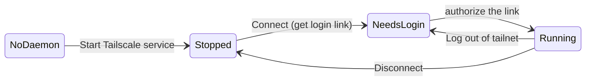

# VPN (Tailscale)

AryaOS ships with [Tailscale](https://tailscale.com/) so you can reach a fielded
unit from anywhere — no port forwarding, no public IP, no firewall holes. Join
the box to your tailnet from the browser and it becomes reachable by its
tailnet name from any other device you own.

## Why Tailscale

Field units live behind whatever network they can get: a base-camp router, a
vehicle hotspot, a cellular modem doing carrier-grade NAT. None of those let you
open an inbound port to the box. Tailscale builds an encrypted WireGuard mesh
between your devices, so the AryaOS unit dials *out* to the coordination service
and you connect to it by name — the same whether it's on the next bench or a
ridge 200 miles away.

!!! info "Tailscale is already in the image"
    The `tailscale` client is installed on current images; you do not install
    anything. You only need a Tailscale account (a "tailnet") and to authorize
    the node once.

!!! warning "Tailscale is remote access, not a replacement for hardening"
    A tailnet reaches Cockpit, SSH, and the sensor dashboards on the box. Keep
    the rest of the [security posture](../security.md) in place — rotate the
    [Node-RED admin password](../admin/aryaos-site.md), let the
    [default password expire](../security.md), and only invite trusted devices
    to your tailnet.

## Connect from Cockpit

Everything happens in the **VPN (Tailscale)** card on
**Cockpit → AryaOS Site**. The card reads `tailscale status --json` and shows
one of a few states, then offers the matching action.

| Card state | What it means | Button offered |
| --- | --- | --- |
| Daemon not running | `tailscaled` isn't started yet | **Start Tailscale service** (`systemctl enable --now tailscaled`) |
| Not logged in | Daemon up, no tailnet | **Connect (get login link)** |
| Running | Joined; tailnet IPs shown | **Disconnect**, **Log out of tailnet** |
| Stopped | Logged in but link is down | **Reconnect**, **Log out of tailnet** |

### First-time connect

1. Open **Cockpit → AryaOS Site → VPN (Tailscale)**.
2. If you see *Tailscale daemon not running*, click **Start Tailscale service**.
3. Click **Connect (get login link)**. The card runs `tailscale up` and waits
   for a login URL.
4. A one-time link of the form `https://login.tailscale.com/…` appears in the
   card. **Open it on any device already signed in to your tailnet** and
   approve the node.
5. The card flips to **Running** and shows the node's tailnet IP address. The
   box is now reachable from your other tailnet devices.

!!! tip "Authorize from your phone"
    You don't have to authorize the link on the box itself — that's the point.
    Copy the login link to a phone or laptop that's already signed in to your
    tailnet, approve it there, and the field unit joins. Click **Cancel login**
    in the card if you change your mind before authorizing.

### Disconnect or leave the tailnet

- **Disconnect** (`tailscale down`) drops the WireGuard link but keeps the node
  enrolled — reconnect later without a new login link.
- **Log out of tailnet** (`tailscale logout`) removes the enrollment entirely.
  The node must get a **new** login link to rejoin. Use this before handing a
  unit to someone else or standing it down.

## Reaching the box over the tailnet

Once the node is **Running**, use its tailnet identity from any of your
signed-in devices:

- **Tailnet IP** — shown in the VPN card (a `100.x.y.z` address). Cockpit is at
  `https://100.x.y.z:9090/`.
- **MagicDNS name** — if MagicDNS is enabled on your tailnet, the box is
  reachable by its hostname (`aryaos-xxxx`) with no IP to remember. Enable
  MagicDNS in the Tailscale admin console; it is a tailnet-wide setting, not an
  AryaOS one.

!!! note "The tailnet IP is separate from the LAN IP"
    The `100.x.y.z` tailnet address rides alongside the box's normal Wi-Fi,
    Ethernet, or [Bluetooth PAN](../bluetooth-pan.md) address. Use whichever
    path is reachable from where you're standing.

## Related

- :material-wifi: **Wi-Fi & onboarding** — get the box onto a network first. [Wi-Fi & onboarding hotspot](wifi-hotspot.md)
- :material-wall-fire: **Firewall** — what's exposed on the box. [Firewall](firewall.md)
- :material-shield-lock: **Security posture** — the full hardening picture. [Security posture](../security.md)
- :material-tune: **AryaOS Site** — the admin page hosting the VPN card. [AryaOS Site](../admin/aryaos-site.md)

