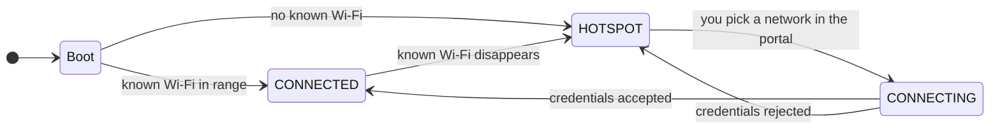

# Wi-Fi & onboarding hotspot

Every AryaOS unit gets on the network without a keyboard or screen: when it can
see a Wi-Fi network it already knows, it joins it; when it can't, it broadcasts
its own **onboarding hotspot** so you can walk up with a phone or laptop and
tell it where to connect. This page covers how that works, how to join a box to
an existing Wi-Fi, and how to protect the hotspot with a password.

## How it works

AryaOS uses [comitup](https://davesteele.github.io/comitup/) on `wlan0` to
manage Wi-Fi. Comitup has two states, and it switches between them
automatically:



- **`CONNECTED`** — the box has joined a Wi-Fi network it has credentials for
  and behaves as a normal client. The onboarding portal is not served in this
  state.
- **`HOTSPOT`** — no known network is in range, so the box broadcasts its own
  access point named **`AryaOS-xxxx`** (the `xxxx` is the per-device suffix set
  at first boot, matching the hostname `aryaos-xxxx`). Connect to that AP and
  the onboarding portal appears so you can hand the box a network.

!!! info "Where the suffix comes from"
    `aryaos-firstboot.sh` derives a 4-hex `DEVICE_SUFFIX` from the machine-ID/MAC
    at first boot and uses it for the hostname (`aryaos-xxxx`) and the hotspot
    SSID (`AryaOS-xxxx`). Comitup fills the `<nnn>` token in `ap_name` from its
    own persistent instance number, so the exact SSID is printed on the box's
    label — trust the label.

## Configuration

Comitup is configured in `/etc/comitup.conf`. The keys AryaOS sets:

| Key | Value | Meaning |
| --- | --- | --- |
| `ap_name` | `AryaOS-<nnn>` | Hotspot SSID and ZeroConf host name. `<nnn>` is a persistent per-device number. |
| `ap_password` | *(unset by default)* | If set, the hotspot uses WPA2 (`WPA-psk`) and requires this password. Must be **8–63 characters**. |
| `primary_wifi_device` | `wlan0` | The Wi-Fi adapter used to spawn the access point. |
| `external_callback` | `/usr/local/sbin/comitup-callback.sh` | Script run on every state change (`HOTSPOT` / `CONNECTING` / `CONNECTED`) so AryaOS can react (for example, toggle onboarding services). |
| `enable_appliance_mode` | `false` | AryaOS does not chain a second adapter or NAT hotspot clients to the internet. |

!!! warning "The hotspot is open by default"
    Out of the box, `ap_password` is unset, so **anyone in range can join the
    onboarding hotspot and reach the portal**. Set a WPA2 password before
    fielding a unit in any area where that matters — see
    [Set a hotspot password](#set-a-hotspot-password) below.

## Join the box to an existing Wi-Fi

Do this when you want the unit to ride your existing wireless network (for
example, a base-camp router or a vehicle hotspot).

1. Power on the AryaOS unit somewhere it *cannot* already see a known network.
   It will come up in `HOTSPOT` mode and broadcast `AryaOS-xxxx`.
2. On a phone or laptop, join the `AryaOS-xxxx` Wi-Fi network. If a hotspot
   password has been set, you will be prompted for it.
3. Open the onboarding portal on port **`9080`** at the hotspot's gateway
   address (most devices pop it up automatically as a captive portal).
4. Choose the target Wi-Fi network from the list, enter its password, and
   confirm.
5. The box moves to `CONNECTING`, then `CONNECTED`. It remembers this network
   and rejoins it automatically on future boots.

!!! tip "You lose the hotspot once it connects"
    When the box successfully joins your Wi-Fi, the `AryaOS-xxxx` hotspot goes
    away — that is expected. Find the unit again by its hostname
    (`aryaos-xxxx.local` via mDNS) or by the IP address your router hands it,
    then administer it in [Cockpit](../admin/aryaos-site.md).

!!! note "No known Wi-Fi, no hotspot? Use Bluetooth."
    If Wi-Fi is unavailable or you are working from a backpack, you can reach
    the same admin surface over a [Bluetooth PAN](../bluetooth-pan.md) link
    (`pan0` at `10.44.0.1`, Cockpit on `https://10.44.0.1:9090/`).

## The onboarding portal

The onboarding portal is comitup's own web UI, served on **TCP `9080`** only
while the box is in `HOTSPOT` mode. It lets you scan for networks and submit
Wi-Fi credentials. The firewall opens `9080` through the `aryaos-comitup`
service (see [Firewall](firewall.md)); comitup itself stops listening once the
box has joined a network.

Because it accepts credentials, treat the onboarding portal like any other
admin surface — do onboarding somewhere you control, and keep the hotspot
password set (below) so a stranger can't reach the portal in the first place.

## Set a hotspot password

Protect the onboarding hotspot with a WPA2 pre-shared key from Cockpit — no
shell required.

=== "In Cockpit (recommended)"

    1. Open **Cockpit → AryaOS Site**.
    2. Scroll to the **Onboarding hotspot password** card.
    3. Type a password of **8–63 characters** into *Hotspot password* and click
       **Save hotspot password**.
    4. To go back to an open AP, click **Remove password (open AP)** and confirm.

    The card writes the `ap_password` key into `/etc/comitup.conf`. The new
    password applies to the *next* hotspot session — **reboot** (or restart
    comitup) to force it to take effect immediately.

=== "Edit the config file"

    Set the key directly in `/etc/comitup.conf`:

    ```ini title="/etc/comitup.conf"
    ap_password: your-8-to-63-char-secret
    ```

    Remove or comment out the line to return to an open AP, then reboot:

    ```bash
    sudo reboot
    ```

!!! danger "Passwords under 8 or over 63 characters are rejected"
    WPA2 pre-shared keys must be 8–63 characters. The Cockpit field enforces
    this (`minlength="8" maxlength="63"`); if you edit the file by hand, stay in
    range or comitup will refuse to bring up a protected AP.

## Related

<div class="grid cards" markdown>

- :material-bluetooth: **Bluetooth PAN** — reach the box with no Wi-Fi at all. [Bluetooth PAN](../bluetooth-pan.md)
- :material-wall-fire: **Firewall** — which inbound ports (including `9080`) are open. [Firewall](firewall.md)
- :material-vpn: **VPN (Tailscale)** — remote access once the box is on a network. [VPN (Tailscale)](vpn-tailscale.md)
- :material-shield-lock: **Security posture** — the full hardening picture. [Security posture](../security.md)

</div>
