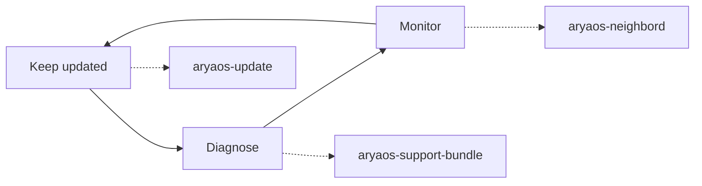

# Operating a fleet

Fielding one AryaOS box is easy; keeping a fleet of them healthy over a fire
season, an exercise, or a search-and-rescue callout is the day-2 job. This
section covers the routine operations: keeping units patched, diagnosing them
when something's off, and letting them find each other on the mesh.

## Day-2 at a glance

- **Keep updated** — apply patches from the signed snstac repo with one click.
  Debian security fixes land automatically; the sensor stack is a deliberate,
  operator-driven decision so you never restart a sensor mid-operation by
  surprise.
- **Diagnose** — when a unit misbehaves in the field, generate a redacted
  support bundle and attach it to a report instead of trying to describe the
  problem over the radio.
- **Monitor** — every AryaOS box beacons itself on Mesh SA, so any unit's
  *Nearby nodes* card shows the rest of the fleet, their roles, health, and a
  direct admin link.

## Operations tasks

- :material-update: **Updates** — one-click patching from the signed snstac apt repo; what's automatic and what isn't. [Updates](updates.md)
- :material-briefcase-search: **Support bundles** — redacted diagnostics for field reports; exactly what's collected and redacted. [Support bundles](support-bundles.md)
- :material-file-certificate: **SBOM & supply chain** — SPDX + CycloneDX for every image build, and the signed-repo trust anchor. [SBOM & supply chain](sbom.md)
- :material-access-point-network: **Nearby nodes** — Mesh SA self-discovery so a fleet finds itself. [Nearby nodes](neighbors.md)
- :material-shield-lock: **Security posture** — the hardening every operation rests on. [Security posture](../security.md)

!!! tip "Most of this lives on one page"
    Software updates, support bundles, the Node-RED admin password, and the
    nearby-nodes list are all cards on **Cockpit → [AryaOS Site](../admin/aryaos-site.md)** —
    one browser page you can drive with gloves on. The pages in this section
    explain what each card does under the hood.

!!! warning "Rotate the Node-RED password before fielding"
    Node-RED ships with a publicly known default admin password and its editor
    can run code on the device. Rotate it from the **Node-RED admin password**
    control on the [AryaOS Site](../admin/aryaos-site.md) page before a unit
    leaves the bench — see [Security posture](../security.md).

## Remote and disconnected operations

Not every unit is within arm's reach:

- **Remote units** — reach a fielded box from anywhere over the
  [Tailscale VPN](../networking/vpn-tailscale.md); no port forwarding required.
- **No-network units** — administer a box over a
  [Bluetooth PAN](../bluetooth-pan.md) link when there's no Wi-Fi or Ethernet.
