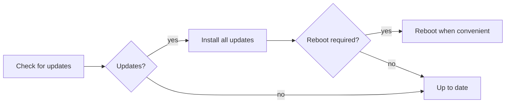

# Updates

Keep a fielded AryaOS unit patched with one click. Updates come from the signed
Sensors & Signals package repository, run in the background so they survive a
closed browser, and never restart your sensors without you saying so.

## One-click updates in Cockpit

The **Software updates** card on **Cockpit → AryaOS Site** is the operator path.

1. Open **Cockpit → AryaOS Site → Software updates**.
2. Click **Check for updates**. The card shows the current AryaOS version and
   lists every upgradable package (with current and candidate versions).
3. Click **Install all updates**. Sensor services may restart briefly while the
   upgrade applies.
4. If a reboot is required afterward, the card tells you — reboot at a
   convenient time.



!!! tip "The upgrade survives a closed browser"
    The card starts the apply step under **`aryaos-update.service`**, not inside
    the browser session. Close the tab, lose Wi-Fi, walk away — the upgrade
    keeps running on the box, and the card picks the result back up when you
    return.

## What's automatic and what isn't

AryaOS splits updates deliberately so an operation is never disrupted by a
surprise sensor restart:

| Update stream | Applied | Why |
| --- | --- | --- |
| **Debian security fixes** | Automatically, daily (`unattended-upgrades`) | OS-level security shouldn't wait for an operator. No automatic reboots. |
| **AryaOS sensor stack** | Manually, when you click **Install all updates** | Restarting a sensor mid-operation is an operator decision, not a background job. |

!!! info "`readsb` is held on purpose"
    `readsb` (the ADS-B decoder) is pinned with `apt-mark hold` so an upgrade
    can't swap the decoder out from under a running air pipeline. The update
    check reports it under `held` so you can see it's intentionally pinned, not
    stuck.

## Where updates come from

Everything installs from the **signed snstac apt repository**,
[`https://snstac.github.io/packages`](https://snstac.github.io/packages). The
repo is GPG-signed, so the box only installs packages it can verify came from
Sensors & Signals. This is the same trust anchor described in
[SBOM & supply chain](sbom.md).

The upgrade preserves your locally edited config files (site config, lighttpd
snippets) rather than prompting or clobbering them: `aryaos-update` applies with
`--force-confdef`/`--force-confold` and runs non-interactively, so a dpkg
conffile prompt can never hang an unattended box.

## The command line

The backend is `/usr/local/sbin/aryaos-update`, and you can run it directly over
SSH:

```bash
sudo aryaos-update check     # refresh apt metadata, print upgradable packages (JSON)
sudo aryaos-update apply     # full-upgrade + autoremove, non-interactive
sudo aryaos-update status    # last check/apply results + reboot-required (JSON)
```

| Subcommand | What it does |
| --- | --- |
| `check` | Runs `apt-get update`, then reports upgradable packages and dpkg holds as JSON. Cached to `/var/lib/aryaos/update-check.json`. |
| `apply` | Non-interactively runs `apt-get full-upgrade` then `autoremove --purge`. Records the result and reboot-required flag to `/var/lib/aryaos/update-apply.json`. |
| `status` | Reports the AryaOS version, whether a reboot is required, and the last check/apply results as JSON. |

!!! note "State lives in `/var/lib/aryaos/`"
    The check and apply results are cached as JSON in `/var/lib/aryaos/` so the
    Cockpit card, `status`, and any tooling see the same picture whether the
    upgrade ran from the browser or the shell.

!!! warning "`apply` requires root"
    `aryaos-update` refuses to run its privileged subcommands as a normal user —
    always `sudo aryaos-update apply`. The Cockpit card handles privilege for
    you.

## Related

<div class="grid cards" markdown>

- :material-file-certificate: **SBOM & supply chain** — the signed-repo trust anchor and per-build SBOMs. [SBOM & supply chain](sbom.md)
- :material-shield-lock: **Security posture** — how the update split fits the hardening story. [Security posture](../security.md)
- :material-briefcase-search: **Support bundles** — capture state if an update goes sideways. [Support bundles](support-bundles.md)
- :material-tune: **AryaOS Site** — the admin page hosting the updates card. [AryaOS Site](../admin/aryaos-site.md)

</div>
