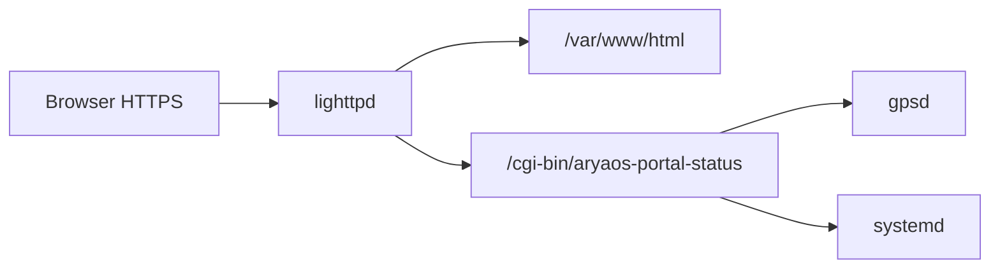

# HTTPS landing portal

The AryaOS **landing page** is static HTML under [`shared_files/aryaos/html/`](../shared_files/aryaos/html/). Live host/network/GNSS/TAK status comes from a **CGI JSON** endpoint (no Node-RED on the critical path).

## Architecture



| Piece | Path (image) | Source in repo |
|-------|----------------|----------------|
| Landing HTML/CSS/JS | `/var/www/html/` | [`shared_files/aryaos/html/`](../shared_files/aryaos/html/) |
| Status CGI | `/usr/lib/cgi-bin/aryaos-portal-status` | [`shared_files/aryaos/cgi-bin/aryaos-portal-status`](../shared_files/aryaos/cgi-bin/aryaos-portal-status) |
| HTTPS + CGI enable | `95-aryaos-cockpit-https.conf`, `10-cgi.conf` | [`shared_files/aryaos/`](../shared_files/aryaos/) via [`scripts/sync-portal-review.sh`](../scripts/sync-portal-review.sh) |
| `www-data` + gpsd / video | `gpsd` + `video` groups (gpspipe, vcgencmd) | pi-gen stage-aryaos + sync script |

**Client:** [`portal-landing.js`](../shared_files/aryaos/html/js/portal-landing.js) polls **`GET /cgi-bin/aryaos-portal-status`** every **8s** (`cache: no-store`).

## Landing page features (current)

- **Hero — TAK gateways:** `charontak`, `adsbcot`, `aiscot`, `lincot`, `dronecot` via `tak_gateways` in JSON; colored tiles (green / amber / red / gray) from `systemctl show`.
- **Hero — system health:** CPU temp, load (1/5/15), power/throttle pill from `system` in JSON (`vcgencmd` on Pi; `/proc` + thermal sysfs fallback).
- **Connection & status:** hostname, FQDN, primary IP, IPv4 block, uptime; grouped rows (`.aos-status-group--meta|net`) with left accent.
- **GNSS:** gpsd snapshot — position, **MSL** (`alt_m`), **HAE** (`altHAE` → `alt_hae_m`), **CE/LE** (`eph` or √(epx²+epy²), `epv` → `le_m`), grid, sats, motion; status **pill** from fix quality.
- **Copy:** icon-only clipboard buttons (SVG); feedback via `.aos-copy-btn--ok` / `--fail` (do not set `textContent` on the button).
- **Radios / RF:** table from `radios.devices` (Wi‑Fi, BT, USB SDR, decoder services).

## CGI JSON (top-level keys)

| Key | Purpose |
|-----|---------|
| `hostname`, `fqdn`, `primary_ip`, `ipv4_text`, `uptime` | Host |
| `gps` | GNSS (`alt_m`, `alt_hae_m`, `ce_m`, `le_m`, `epx_m`, …) |
| `tak_gateways` | `{ ok, items[] }` per gateway unit (`charontak`, feeders) |

Node-RED is **not** on the configuration critical path; use Cockpit and Comitup for writes (see [node-red.md](node-red.md)).
| `system` | `{ ok, cpu_temp_c, load{1,5,15}, mem{total_mb,available_mb,used_pct}, throttle{raw,state,current[],history[]} }` |
| `radios` | `{ ok, devices[] }` RF inventory |

## AryaOS Neighbor Discovery

LINCOT emits the local host beacon through Charontak like every other AryaOS CoT
producer. AryaOS adds a structured `<aryaos>` detail element to that beacon via
`/usr/local/sbin/aryaos-cot-detail`. The detail carries hostname, admin URL, source IP,
roles, service states, and coarse system health.

`aryaos-neighbord.service` listens on the Mesh SA multicast group `239.2.3.1:6969`,
parses CoT events containing `<detail><aryaos>`, and writes a TTL cache to
`/run/aryaos/neighbors.json`. The landing page reads that cache through
`/cgi-bin/aryaos-neighbors` to show nearby AryaOS boxes and admin links.

## Deploy to lab Pi (fast iteration)

From repo root (host must reach **`172.17.2.158`**; see [dev-pi.md](dev-pi.md)):

```bash
ARYAOS_SSH=aryaos-dev-pi ./scripts/sync-portal-review.sh
```

(`Host aryaos-dev-pi` in `~/.ssh/config` with `User pi` is enough; `pi@aryaos-dev-pi` also works.)

Full tree mirror (optional): `./scripts/sync-to-dev-pi.sh` then portal script above.

## Image / pi-gen

Installed in **stage-aryaos** [`00-run.sh`](../stages/stage-aryaos/00-install/00-run.sh) (HTML + CGI). Ansible mirror: [`stages/stage-aryaos/tasks/cockpit-proxy.yml`](../stages/stage-aryaos/tasks/cockpit-proxy.yml).

After portal/CGI edits on **`main`**, CI builds a new image; local lab can use **sync-portal-review** without waiting for CI.

## Agent handoff — state as of 2026-05-16

**On `main` (pushed):**

| Commit | Topic |
|--------|--------|
| `f63f83b` | Lab Pi SSH sync scripts, readsb RTL flag order |
| `dd742d9` | TAK gateway mission strip |
| `0b2a23b` | USB current `config.txt` fragment (pi-gen + `enable-pi-usb-current.sh`) |
| `79b096e` | GNSS MSL/HAE, CE/LE, text Copy buttons |
| `8d2304a` | Status UI polish: grouped rows, icon copy, GNSS pill, TAK tile tints |

**Lab Pi (`aryaos-dev-pi` / `172.17.2.158`) — operational notes:**

- **readsb:** pi-gen now runs [`readsb-install.sh`](../shared_files/adsbcot/readsb-install.sh) (`RTLSDR=yes`) after the stock `.deb` and restores the AryaOS `run_readsb.sh` unit.
- **readsb RTL serial `2002`:** `RECEIVER_OPTIONS="--device-type rtlsdr --device 2002 …"`; helper [`scripts/readsb-use-rtl-serial.sh`](../scripts/readsb-use-rtl-serial.sh).
- **adsbcot** enabled; polls `file:///run/adsb/aircraft.json` (same path for readsb or dump1090-fa).
- **USB power:** `enable-pi-usb-current.sh` applied; **reboot** if not done since append.
- **Portal UI polish (`8d2304a`):** may **not** be on the Pi until `sync-portal-review` succeeds from a host on the lab LAN (agent environment often gets **No route to host**).

## Next steps for agents

1. **Verify portal on lab Pi** (when SSH works):  
   `ARYAOS_SSH=aryaos-dev-pi ./scripts/sync-portal-review.sh` → open `https://<pi>/` — check TAK strip, GNSS CE/LE/HAE, icon copy, grouped status rows.
2. **Optional follow-ups (not started):**
   - RF table: per-row copy or compact state badges (v1 scope excluded icon copy on RF).
   - `adsbcot_feed_ok`: mark ADS-B chip degraded if `readsb` up but `aircraft.json` stale/empty.
   - Confirm next CI image: `readsb` starts with RTL dongle without manual `readsb-install.sh`.
   - lighttpd: add **`mod_openssl`** to `server.modules` (sync logs a future-deprecation warning).
3. **After meaningful portal/CGI/HTML edits:** run **`sync-portal-review.sh`** on the Pi; for image parity rely on CI **`main`** build or local **`make build-docker`**.

See also [AGENTS.md](../AGENTS.md) (build + lab Pi) and [dev-pi.md](dev-pi.md).
