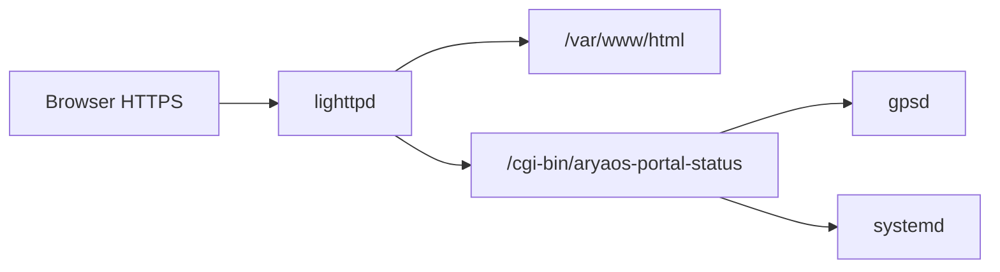

# HTTPS landing portal

The AryaOS **landing page** is static HTML under [`shared_files/aryaos/html/`](https://github.com/snstac/aryaos/blob/main/shared_files/aryaos/html/). Live host/network/GNSS/TAK status comes from a **CGI JSON** endpoint (no Node-RED on the critical path).

## Architecture


```mermaid
flowchart LR
  browser[Browser HTTPS]
  lighttpd[lighttpd]
  html["/var/www/html"]
  cgi["/cgi-bin/aryaos-portal-status"]
  gpsd[gpsd]
  systemd[systemd]
  browser --> lighttpd
  lighttpd --> html
  lighttpd --> cgi
  cgi --> gpsd
  cgi --> systemd
```

| Piece | Path (image) | Source in repo |
|-------|----------------|----------------|
| Landing HTML/CSS/JS | `/var/www/html/` | [`shared_files/aryaos/html/`](https://github.com/snstac/aryaos/blob/main/shared_files/aryaos/html/) |
| Status CGI | `/usr/lib/cgi-bin/aryaos-portal-status` | [`shared_files/aryaos/cgi-bin/aryaos-portal-status`](https://github.com/snstac/aryaos/blob/main/shared_files/aryaos/cgi-bin/aryaos-portal-status) |
| HTTPS + CGI enable | `95-aryaos-cockpit-https.conf`, `10-cgi.conf` | [`shared_files/aryaos/`](https://github.com/snstac/aryaos/blob/main/shared_files/aryaos/) via [`scripts/sync-portal-review.sh`](https://github.com/snstac/aryaos/blob/main/scripts/sync-portal-review.sh) |
| `www-data` + gpsd / video | `gpsd` + `video` groups (gpspipe, vcgencmd) | pi-gen stage-aryaos + sync script |
| Cockpit `/admin/` branding | `/usr/share/cockpit/branding/{debian,default}/` | `shared_files/aryaos/cockpit/branding.css` + canonical `docs/brand/logo/mark-aryaos-rev.svg` via the overlay package |

**Client:** [`portal-landing.js`](https://github.com/snstac/aryaos/blob/main/shared_files/aryaos/html/js/portal-landing.js) polls **`GET /cgi-bin/aryaos-portal-status`** every **8s** (`cache: no-store`).

The Cockpit login and shell at **`/admin/`** use the canonical reverse AryaOS Signal Block from the
brand guide. The overlay installs the stylesheet and SVG into Cockpit's `debian` and `default`
branding directories. This keeps the mark consistent across OS brands and makes it available
before login.

## Landing page features (current)

- **Hero - TAK gateways:** Shows gateway state from `tak_gateways` in JSON. The UAS tile combines DJI, Wi-Fi, BLE, DroneScout, and SAPIENT units. The SENSORS count includes active sensor gateways only.
- **Hero - system health:** Shows CPU temperature, load, and power state from `system` in JSON. The sandbox exposes only `/dev/vcio_gencmd` for Pi telemetry. Unavailable telemetry appears as **UNKNOWN**.
- **Connection & status:** Shows hostname, FQDN, primary IP, IPv4 addresses, and uptime in grouped rows.
- **GNSS:** Shows the gpsd position, altitude, accuracy, grid, satellites, motion, and fix-quality status.
- **Copy:** Uses icon-only clipboard buttons. The `.aos-copy-btn--ok` and `--fail` classes provide feedback.
- **Radios / RF:** table from `radios.devices` (Wi‑Fi, BT, USB SDR, decoder services).

## CGI JSON (top-level keys)

| Key | Purpose |
|-----|---------|
| `hostname`, `fqdn`, `primary_ip`, `ipv4_text`, `uptime` | Host |
| `gps` | GNSS (`alt_m`, `alt_hae_m`, `ce_m`, `le_m`, `epx_m`, ...) |
| `tak_gateways` | `{ ok, items[] }` per displayed gateway capability. Aggregate items include member `units[]` with live systemd state. |

Node-RED is **not** on the configuration critical path. Use Cockpit and Comitup for writes (see [node-red.md](node-red.md)).
| `system` | `{ ok, cpu_temp_c, load{1,5,15}, mem{total_mb,available_mb,used_pct}, throttle{raw,state,current[],history[]} }` |
| `radios` | `{ ok, devices[] }` RF inventory. Known SDRs include structured `frequency_range_mhz` coverage. |

## AryaOS Neighbor Discovery

LINCOT emits the local host beacon through COTBridge like every other AryaOS CoT
producer. AryaOS adds a structured `<__aryaos>` detail element to that beacon via
`/usr/local/sbin/aryaos-cot-detail`. The detail carries hostname, admin URL, source IP,
roles, service states, and coarse system health.

`gutcheck.service` listens on Mesh SA, DNS-SD/mDNS, and SSDP, then writes a TTL
Cache to `/run/gutcheck/neighbors.json`. If LINCOT has no current self beacon,
GutCheck emits a low-rate CoT fallback without a position. The node remains
visible, and GutCheck does not replace a newer LINCOT position. The landing page
reads the cache through `/cgi-bin/aryaos-neighbors` to show nearby AryaOS boxes and
admin links.

## Deploy to a lab device (fast iteration)

From the repo root, discover a unique device (see [dev-pi.md](dev-pi.md)):

```bash
./scripts/sync-portal-review.sh
```

Use `ARYAOS_DEV_DEVICE=<hostname-or-uid>` when multiple devices are visible or
`ARYAOS_SSH=pi@<address>` when multicast discovery is unavailable.

Full tree mirror (optional): `./scripts/sync-to-dev-pi.sh` then portal script above.

## Image / pi-gen

Installed in **stage-aryaos** [`00-run.sh`](https://github.com/snstac/aryaos/blob/main/stages/stage-aryaos/00-install/00-run.sh) (HTML + CGI). Ansible mirror: [`stages/stage-aryaos/tasks/cockpit-proxy.yml`](https://github.com/snstac/aryaos/blob/main/stages/stage-aryaos/tasks/cockpit-proxy.yml).

After portal/CGI edits on **`main`**, CI builds a new image. Local lab can use **sync-portal-review** without waiting for CI.

## Agent handoff - state as of 2026-05-16

**On `main` (pushed):**

| Commit | Topic |
|--------|--------|
| `f63f83b` | Lab Pi SSH sync scripts, readsb RTL flag order |
| `dd742d9` | TAK gateway mission strip |
| `0b2a23b` | USB current `config.txt` fragment (pi-gen + `enable-pi-usb-current.sh`) |
| `79b096e` | GNSS MSL/HAE, CE/LE, text Copy buttons |
| `8d2304a` | Status UI polish: grouped rows, icon copy, GNSS pill, TAK tile tints |

**Historical lab device - operational notes:**

- **readsb:** pi-gen now runs [`readsb-install.sh`](https://github.com/snstac/aryaos/blob/main/shared_files/adsbcot/readsb-install.sh) (`RTLSDR=yes`) after the stock `.deb` and restores the AryaOS `run_readsb.sh` unit.
- **readsb RTL serial `2002`:** `RECEIVER_OPTIONS="--device-type rtlsdr --device 2002 ..."`. Helper [`scripts/readsb-use-rtl-serial.sh`](https://github.com/snstac/aryaos/blob/main/scripts/readsb-use-rtl-serial.sh).
- **adsbcot** enabled. Polls `file:///run/adsb/aircraft.json` (same path for readsb or dump1090-fa).
- **USB power:** `enable-pi-usb-current.sh` applied. **reboot** if not done since append.
- **Portal UI polish (`8d2304a`):** can **not** be on the Pi until `sync-portal-review` succeeds from a host on the lab LAN (agent environment often gets **No route to host**).

## Next steps for agents

1. **Verify portal on lab Pi** (when SSH works):  
   `./scripts/sync-portal-review.sh` > open the discovered device's HTTPS portal
   and check the TAK strip, GNSS CE/LE/HAE, icon copy, and grouped status rows.
2. **Optional follow-ups (not started):**
   - RF table: per-row copy or compact state badges (v1 scope excluded icon copy on RF).
   - `adsbcot_feed_ok`: mark ADS-B chip degraded if `readsb` up but `aircraft.json` stale/empty.
   - Confirm next CI image: `readsb` starts with RTL dongle without manual `readsb-install.sh`.
   - lighttpd: add **`mod_openssl`** to `server.modules` (sync logs a future-deprecation warning).
3. **After meaningful portal, CGI, or HTML edits:** run **`sync-portal-review.sh`** on the Pi. Use a CI or local image build for image parity.

See also [AGENTS.md](https://github.com/snstac/aryaos/blob/main/AGENTS.md) (build + lab Pi) and [dev-pi.md](dev-pi.md).
